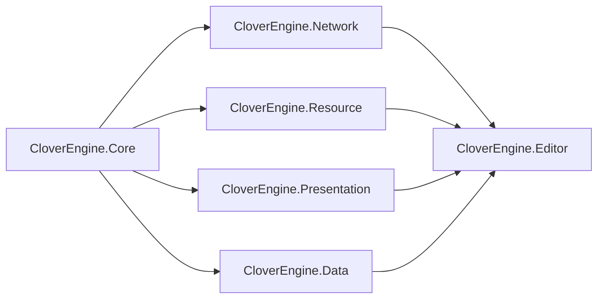

## 本页内容

本文档介绍 Clover Unity 客户端引擎的整体架构、模块划分和目录结构。

## 前置条件

- 已了解 [Clover 框架概述](/)
- 已安装 **Unity 6（6000.x）**（引擎包 `package.json` 声明 `unity: 6000.0`，开发与验证版本也是 Unity 6）

## 这篇文档讲什么？

Clover 客户端引擎采用**能力域划分**的设计模式，将引擎功能划分为网络域、表现域、数据域、资源域和基础域五大能力域。每个能力域包含多个功能模块，通过 Game 门面统一对外提供服务。

## 与服务端的关系

Clover 客户端与服务端 `clover-server-engine` 的对齐只发生在两个层面：

| 对齐层面 | 说明 |
|----------|------|
| **API 语义** | `OnMsg` / `On` / `Timer.After/Every` / `Fsm.Trigger` 拼写与语义一致 |
| **网络协议** | 帧格式、EMsg 消息号、ObjectID 位布局逐字节一致 |

> **注意：**   除此之外**不镜像服务端目录结构**，客户端按自己的能力域组织。

> **提示：**   领域概念的命名约定（如 `Game.Scene` 与 `CloverScene` 的区别）见 [双端概念命名约定](concept-naming.md)。

## 模块架构图

```mermaid
graph TD
    subgraph "业务游戏代码"
        Game[Game 门面]
    end
    
    subgraph "能力域划分"
        subgraph "网络域 Network"
            Net[Network<br/>网络通信]
            WorldSync[WorldSync<br/>世界同步]
            WebRequest[WebRequest<br/>HTTP 请求]
        end
        
        subgraph "表现域 Presentation"
            Entity[Entity<br/>实体管理]
            ObjectPool[ObjectPool<br/>对象池]
            Scene[Scene<br/>场景管理]
            UI[UI<br/>界面管理]
            Atlas[SpriteAtlas<br/>图集管理]
            Anim[Animation<br/>动画控制]
            Sound[Sound<br/>音效管理]
            Camera[Camera<br/>相机控制]
            Quality[Quality<br/>画质与性能]
        end
        
        subgraph "数据域 Data"
            DataTable[DataTable<br/>配表管理]
            Setting[Setting<br/>设置管理]
            Localization[Localization<br/>多语言]
        end
        
        subgraph "基础域 Core"
            Event[Event<br/>事件系统]
            Timer[Timer<br/>定时器]
            Fsm[Fsm<br/>状态机]
            Dispatcher[Dispatcher<br/>主线程调度]
            Logger[Logger<br/>日志系统]
        end
    end
    
    subgraph "Editor 横切"
        Debugger[Debugger<br/>调试面板]
    end
    
    Game --> Net
    Game --> Entity
    Game --> Pool
    Game --> Event
    Game --> Timer
    Game --> Res
    Game --> Table
    Game --> Http
    Game --> Sync
    Game --> Scene
    Game --> UI
    Game --> Atlas
    Game --> Anim
    Game --> Sound
    Game --> Camera
    Game --> Quality
    
    Net --> Event
    Net --> Timer
    
    DataTable --> Event
    DataTable --> Logger
    
    Resource --> Logger
    
    Debugger --> Net
    Debugger --> Entity
```



## 能力域划分

### 基础域 (Core)

基础域是整个引擎的基石，不依赖任何其他模块。

| 模块 | 说明 | 核心功能 |
|------|------|----------|
| **Event** | 事件系统 | 进程内发布/订阅（**同步分发**，无异步事件） |
| **Timer** | 定时器 | 延迟执行、循环执行，与 Unity 生命周期同步 |
| **Fsm** | 有限状态机 | 状态管理、转换、守卫条件 |
| **Dispatcher** | 主线程调度器 | 确保所有业务回调在 Unity 主线程执行 |
| **Logger** | 日志系统 | 分级日志、条件日志、外部上报出口 |

```csharp 示例：基础域模块使用
// 事件系统（带参事件用显式 On<T>）
Game.Event.On<int>("Player.LevelUp", level => {
    Debug.Log($"玩家升级: {level}");
});

// 定时器
Game.Timer.After(2.0f, () => {
    Debug.Log("2秒后执行");
});

// 主线程调度
Game.Dispatcher.Post(() => {
    // 在主线程执行UI更新
});
```

### 数据域 (Data)

数据域负责数据管理，依赖基础域。

| 模块 | 说明 | 核心功能 |
|------|------|----------|
| **DataTable** | 配表管理 | 读取/查询配置表，支持热重载 |
| **Localization** | 多语言 | 本地化字符串、资源加载 |

> **注意：** `Setting` 的实现是 `Runtime/Core/Setting.cs`，属**基础域**（`Game.Setting` 在 Core 的构造函数里创建，
> 见 `Runtime/Core/Game.cs:384`；`Game.SettingDir` 配持久化目录）。

```csharp 示例：数据域模块使用
// 配表查询
var heroConfig = Game.Table.Get<HeroConfig>(1001);
Debug.Log($"英雄名称: {heroConfig.Name}");

// 设置管理
Game.Setting.Set("MusicVolume", 0.8f);
float volume = Game.Setting.Get<float>("MusicVolume", 1.0f);

// 多语言
string greeting = Game.Localization.Get("ui.greeting");
```

### 网络域 (Network)

网络域负责网络通信，**只依赖基础域**。⛔ "依赖数据域"是错的：Network 的 asmdef 只引用 Core，
对数据/资源的访问是**运行时经 `Game` 门面**发生的，不是程序集依赖 —— 见本节 asmdef 表与 `module-dependencies.md`。

| 模块 | 说明 | 核心功能 |
|------|------|----------|
| **Network** | 网络通信 | TCP/UDP 双通道，自动重连，消息收发 |
| **WorldSync** | 世界同步 | 状态同步，消费服务端 AOI 结果，增量同步（客户端不建 AOI 网格） |
| **WebRequest** | HTTP 请求 | RESTful API 调用，文件下载 |

```csharp 示例：网络域模块使用
// 发送消息
// 账号密码只发给账号服（HTTP）换 token；ELoginRequest 只有 token 字段。
var token = await CloverAuth.LoginAsync("test", "123456");
var reply = await Game.Net.Call<ELoginReply>(EMsg.Login, new ELoginRequest
{
    token = token,
});

// 监听推送（玩家全量同步走 Game.Sync.OnFullSync；引擎推送号在保留段、不可经 Game.OnMsg 注册）
Game.Sync.OnFullSync((data, accountData) => {
    // 引擎内部自动处理全量同步，业务通过 IWorldSync 回调感知变化
});
```

### 表现域 (Presentation)

表现域负责表现层，**只依赖基础域**（⛔ "依赖资源域"是错的：Presentation 的 asmdef 只引用 Core；对资源/数据的访问是**运行时经 `Game` 门面**发生的，不是程序集依赖）。所有模块均已挂载到 Game 门面，业务直接通过 `Game.UI` / `Game.Scene` / `Game.Sound` / … 访问，无需手动初始化：

| 模块 | 说明 | 核心功能 | Game 门面 |
|------|------|----------|-----------|
| **Entity** | 实体管理 | Entity 驱动 View，数据绑定 | `Game.Entity` ✓ |
| **ObjectPool** | 对象池 | GameObject 池化复用，避免 GC | `Game.Pool` ✓ |
| **Input** | 输入管理 | 键鼠/手柄/触摸统一读取，后端无关 | `Game.Input` ✓（需先 `CloverInput.Init()`，见 [输入](../development/input.md)） |
| **Scene** | 场景管理 | 异步加载/卸载场景 | `Game.Scene` ✓ |
| **UI** | 界面管理 | UI 生命周期管理，层级管理 | `Game.UI` ✓ |
| **SpriteAtlas** | 图集管理 | 图集加载/卸载，内存优化 | `Game.Atlas` ✓ |
| **Animation** | 动画控制 | Unity `Animator` 封装：播放 / 淡入 / 参数 / 完成回调（**不含状态机编辑、混合树、IK**；骨骼动画不在引擎范围） | `Game.Anim` ✓ |
| **Sound** | 音效管理 | 背景音乐、音效、3D 音效 | `Game.Sound` ✓ |
| **Camera** | 相机控制 | 相机跟随、震动、特效 | `Game.Camera` ✓ |
| **Quality** | 画质与性能 | 画质档位 / 预设 / 帧率监控与自动降档（**过热监控未实现**：`CheckBatteryTemperature` 为空实现）（设备标识是另一模块 `Game.DeviceId`，归 Core） | `Game.Quality` ✓ |

```csharp 示例：表现域模块使用
// 所有表现域模块随 Game.Launch 自动挂载
Game.Scene.Load("BattleScene");
Game.UI.Open<LoginPanel>();
Game.Sound.PlayBGM("bgm_main");
Game.Atlas.GetSprite("ui_common", "btn_ok", sp => { });
var anim = Game.Anim.CreateAnimator(enemyGo, controller);
Game.Camera.Follow(enemyGo.transform);   // CreateAnimator 返回 IAnimPlayer（无 transform），Follow 取目标的 Transform
Game.Quality.AutoDetect();
```

## UPM 包结构

```
com.clover.unity-engine/
├── Runtime/
│   ├── Core/         Game / Event / Timer / Fsm（含 Game.NewFsm 多实例）/ Dispatcher / Logger / Setting / Json / DeviceId
│   │                 / Separation2D（角色间水平推开） / HitShape（命中几何：扇形+走廊+线段） / ProjectileRuntime（投射物飞行积分+逐格扫掠）
│   │                 / GridGraph / GridBitSet / GridUtil（格图算法 / 格集合位图编解码 / 矩形格遍历）
│   │                 / PathFollower（沿 A* 逐格推进+转向） / EnterLatch / StableHash（状态闩锁 / 生成结果哈希）
│   │                 / LogThrottle / Screenshot / JsonWriter / ServiceAutoWire / OrderedAsyncResult / ClientConfig（ConfigSectionLoader：配置来源链）
│   ├── Data/         DataTable / Localization
│   ├── Network/      Network / WebRequest / WorldSync / SchemaRegistryManager（Schema 声明表，**不承担数据订阅**；订阅走 WorldSync）
│   │                 / Lan（局域网寻服：LanBrowser 发现端 + ILanResponder 应答端，UDP 旁路）
│   ├── Resource/     Resource（后端抽象 / Resources / AssetBundle / 清单热更）
│   └── Presentation/ Scene / Entity / ObjectPool(GameObject) / UI / UIWidgets / SpriteAtlas
│                     / Animation / Sound / Input / Camera / Quality
│                     / CloverFirstPersonCamera（第一人称 rig，纯逻辑类）
│                     / 瓦片族：TileWorld（空间事实） / TileRenderer（渲染内核） / TileRenderState（一格渲染状态）
│                     /          TileNodePool（逐格节点池） / TilemapGenUtil（程序化生成） / ChunkedTilePlanner（分块+每帧预算）
│                     / SpriteEntityView / SpriteFrameAnimator / SpriteSet / BitmapFont / TextFit / WorldOverlayWidgets
│                     / SortingLayers / SnapshotInterpolator / UnitFacingMap / RuntimePanelProvider / UIPanelGuards / UiImageLoader
│                     / SpriteStripLoader / SpriteSwapButton / PointerFloatLayer / DragDropLayer / DragGestureRouter
│                     / CameraBoundsKit / CameraMath / LoadingPacing / FramePacingPolicy
├── Editor/           Debugger（含 GM 控制台） / MapBake（地图烘焙） / SceneScaffold（最小可运行场景脚手架） / PixelArtSlicing + PixelArtImportSettings/Postprocessor（像素素材导入规范） / PanelPrefabBuilder（面板壳预制体）
└── Tests/            Editor + PlayMode 测试
```

### asmdef 规范

每个目录一个 asmdef，引用方向即上述规则，编译期挡反向依赖。

| asmdef | 所在目录 | 可引用 |
|--------|---------|--------|
| `CloverEngine.Core` | Runtime/Core | （无依赖） |
| `CloverEngine.Data` | Runtime/Data | Core |
| `CloverEngine.Network` | Runtime/Network | Core |
| `CloverEngine.Resource` | Runtime/Resource | Core |
| `CloverEngine.Presentation` | Runtime/Presentation | Core |
| `CloverEngine.Editor` | Editor | 全部 Runtime asmdef |



## 引擎边界（明确不做）

| 能力 | 归属 | 引擎提供的衔接 |
|------|------|--------------|
| 渠道 SDK（登录/支付/分享/广告） | 发行接入层（独立工程） | Game 启动流程留 SDK 初始化钩子 |
| Crash 收集（Bugly 等） | 第三方 SDK | Logger 可挂外部上报出口 |
| 数据埋点 | 业务层 | 经 Event 总线订阅，业务自行上报 |
| 新手引导 | 业务层 | UI 提供遮罩/高亮组件 |
| 语音/视频 | 第三方 SDK | 无 |
| 反作弊/加固 | 发行环节 | 无 |

> **注意：**   引擎只提供**能力基础**，具体业务逻辑由游戏项目自行实现。

## 下一步

1. **了解设计理念** → [设计原则](design-principles.md)
2. **了解模块依赖** → [模块依赖规则](module-dependencies.md)
3. **开始开发** → [Game 门面](../development/game-facade.md) → [网络与会话](../development/network.md)

