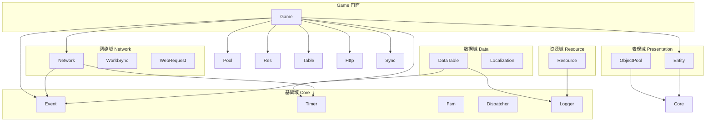
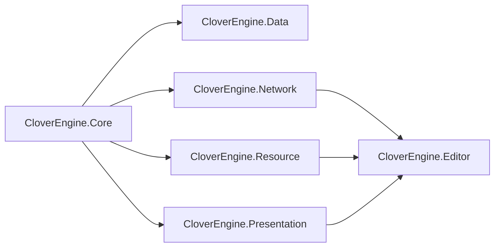
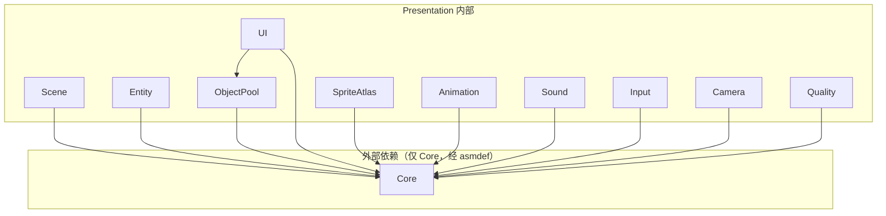

## 本页内容

本文档定义 Clover Unity 客户端引擎模块间的依赖方向和 asmdef 规范。

## 前置条件

- 已了解 [架构总览](architecture.md)
- 已了解 [设计原则](design-principles.md)

## 这篇文档讲什么？

Clover 客户端引擎采用严格的分层依赖架构，确保模块间的解耦和编译期安全。本文档详细说明各模块的依赖方向、asmdef 配置规范以及违反依赖的后果。

## 依赖方向

### 依赖关系图



### 依赖规则表

| 域 | 可依赖 | 不可依赖 | 说明 |
|----|--------|----------|------|
| **基础域 (Core)** | 无 | 所有其他域 | 引擎基石，完全独立 |
| **数据域 (Data)** | 基础域 | 网络域、表现域、资源域 | 数据管理，依赖事件系统 |
| **资源域 (Resource)** | 基础域 | 网络域、数据域、表现域 | 资源加载，与数据域解耦 |
| **网络域 (Network)** | 基础域 | 数据域、表现域、资源域 | 网络通信，与数据域解耦 |
| **表现域 (Presentation)** | 基础域 | 网络域、数据域、资源域 | 仅依赖基础域；对资源 / 数据的访问经 `Game` 门面（运行时），不是编译期依赖 |
| **Game 门面** | 所有域 | 无 | 统一入口，聚合全部能力 |

### 依赖方向详解

```
Presentation（表现域）──┐
Data（数据域）──────────┤
Network（网络域）───────┼──→ Base（基础域）
Resource（资源域）──────┘
```

> 各域程序集**只引用 `Core`**，域之间互不引用（编译期强制）；跨域协作经 `Game` 门面与 `Event` 总线（运行时）。

> **注意：**   基础域（Event/Timer/Fsm/Dispatcher/Logger）是整个引擎的基石，不依赖任何其他模块。

## asmdef 强制规范

每个目录一个 asmdef，引用方向即上述规则，编译期挡反向依赖。

### asmdef 配置表

| asmdef | 所在目录 | 可引用 | 说明 |
|--------|---------|--------|------|
| `CloverEngine.Core` | Runtime/Core | （无依赖） | 基础域，完全独立 |
| `CloverEngine.Data` | Runtime/Data | Core | 数据域，依赖基础域 |
| `CloverEngine.Network` | Runtime/Network | Core | 网络域，仅依赖基础域 |
| `CloverEngine.Resource` | Runtime/Resource | Core | 资源域，仅依赖基础域 |
| `CloverEngine.Presentation` | Runtime/Presentation | Core | 表现域，仅依赖基础域（模块内部引用不通过 asmdef） |
| `CloverEngine.Editor` | Editor | 全部 Runtime asmdef | 编辑器工具，可访问所有运行时模块 |

### asmdef 依赖图



### asmdef 文件示例

```json CloverEngine.Network.asmdef
{
    "name": "CloverEngine.Network",
    "rootNamespace": "CloverEngine",
    "references": [
        "CloverEngine.Core"
    ],
    "includePlatforms": [],
    "excludePlatforms": [],
    "allowUnsafeCode": false,
    "overrideReferences": false,
    "precompiledReferences": [],
    "autoReferenced": true,
    "defineConstraints": [],
    "versionDefines": [],
    "noEngineReferences": false
}
```

## Presentation 内部模块

Presentation 目录内各模块同层，UI 不依赖 Scene，Sound 不依赖 Animation。

### Presentation 模块结构

```
Presentation/
├── Scene.cs          场景管理 (ISceneManager)
├── Entity.cs         实体管理 (IEntityManager) ← 已挂载到 Game.Entity
├── ObjectPool.cs     对象池 (IObjectPool) ← 已挂载到 Game.Pool
├── UI.cs             UI 管理 (IUIManager)
├── SpriteAtlas.cs    图集 (ISpriteAtlasManager)
├── Animation.cs      动画 (IAnimationManager)
├── Sound.cs          音效 (ISoundManager)
├── Input.cs          输入 (IInputManager)
├── Camera.cs         相机 (ICameraManager)
└── Quality.cs        画质与性能档位 (IQualityManager)
```

### Presentation 内部依赖规则

> **说明：** Presentation asmdef 仅引用 Core。内部模块间的代码级依赖（如 UI 使用 ObjectPool）通过接口解耦，不违反 asmdef 编译约束。



## 游戏工程引用

```csharp C#
using CloverEngine; // 拿 Game 门面起步
```

游戏工程只需引用 `CloverEngine.Presentation`（或按需引用更少的 asmdef），即可通过 `Game` 门面访问所有能力。

### 推荐引用方式

| 方式 | 说明 | 适用场景 |
|------|------|----------|
| **推荐** | 引用 `CloverEngine.Presentation`，获得全部能力 | 大多数项目 |
| **精简** | 按需引用更少的 asmdef，减少依赖 | 轻量级项目或特定模块 |

### manifest.json 配置

```json Packages/manifest.json
{
  "dependencies": {
    "com.clover.unity-engine": "https://github.com/qw576483/clover-client-unity-engine.git"
  }
}
```

> 引擎是独立仓库（UPM 包），**推荐用上面的 git URL**，别人 clone 工程即可打开。
> 仅当要在本机联调引擎源码时才改用本地路径，且**基准是 `Packages/` 目录**：
> `"file:../../../clover-client-unity-engine"`（指到与工程仓库同父的那一层）。
> 不要写 `file:../clover-client-unity-engine`（会解析成 `<工程根>/clover-client-unity-engine`，必报找不到 `package.json`），也不要写绝对路径。

## 违反依赖的后果

> **警告：**   违反依赖规则会导致编译失败：

### 反向依赖示例

```csharp 错误示例
// ❌ 错误：Presentation 依赖 Network（反向依赖）
// CloverEngine.Presentation.asmdef 不能引用 CloverEngine.Network

// ✅ 正确：通过 Game 门面访问
Game.Net.Send(EMsg.Xxx, msg);
```

### 编译错误信息

如果违反依赖规则，Unity 编译器会报错：

```
The type or namespace name 'Network' could not be found (are you missing a using directive or an assembly reference?)
```

### 依赖检查工具

可以使用以下方式检查依赖违规：

1. **asmdef 检查**：在 Unity 编辑器中检查 asmdef 文件的引用配置
2. **编译检查**：编译时自动检测反向依赖
3. **静态分析**：使用工具分析代码依赖关系

## 依赖最佳实践

### 1. 最小权限原则

只引用必要的 asmdef，避免不必要的依赖。

```csharp 推荐做法
// 如果只需要基础功能，只引用 Core
// 如果需要数据管理，引用 Core + Data
// 如果需要网络功能，引用 Core + Data + Network
```

### 2. 依赖注入

通过依赖注入避免硬编码依赖。

```csharp 推荐做法
// ❌ 硬编码依赖
public class MyService
{
    private NetworkManager network = Game.Net;
}

// ✅ 依赖注入
public class MyService
{
    private readonly INetworkManager network;
    
    public MyService(INetworkManager network)
    {
        this.network = network;
    }
}
```

### 3. 接口隔离

使用接口隔离依赖，只暴露必要的方法。

```csharp 推荐做法
// ❌ 暴露完整实现
public class NetworkManager
{
    public void Send(byte[] data) { }
    public void Connect() { }
    public void Disconnect() { }
}

// ✅ 接口隔离
public interface ISendable
{
    void Send(byte[] data);
}

public interface IConnectable
{
    void Connect();
    void Disconnect();
}
```

## 下一步

- **了解架构** → [架构总览](architecture.md)
- **了解设计原则** → [设计原则](design-principles.md)
- **开始开发** → [Game 门面](../development/game-facade.md) → [网络与会话](../development/network.md)