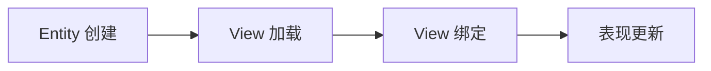

# Entity 与 View

## 这篇文档讲什么？

本指南介绍 Entity（实体数据）和 View（视图）的使用方法，帮助开发者理解数据与表现的分离。

**目标读者**：需要实现游戏对象管理的 Unity 开发者。

## 前置条件

- 已完成 [快速开始](./quick-start.md)
- 了解 [Game 门面](./game-facade.md)
- 了解 [资源管理](./resource.md)

## Entity（实体数据）

> **注意：** Entity 不继承 MonoBehaviour，View 异步绑定。

Entity 是纯数据对象，不继承 MonoBehaviour。

### 核心能力

| 能力 | 说明 |
|------|------|
| ObjectID | 位布局同服务端，全局唯一标识 |
| TypeID | 实体类型 ID（配表模型/类型） |
| 所属场景 | 场景切换时自动分组管理 |

> `EntityInfo` 是**只读快照**（ObjectID / TypeID / SceneGroup 三个字段），**不含属性集、不含 View**：属性数据走 `Game.Sync`（见 [worldsync.md](./worldsync.md)），视图存取走 `Game.Entity.BindView` / `GetView`。

### API 参考

| API | 参数 | 返回值 | 说明 |
|-----|------|--------|------|
| `Game.Entity.Create(objectID, typeID, group)` | `long, int, string` | `EntityInfo` | 创建实体 |
| `Game.Entity.Destroy(objectID)` | `long` | `void` | 销毁实体 |
| `Game.Entity.Get(objectID)` | `long` | `EntityInfo` | 按 ID 查询 |
| `Game.Entity.GetAll()` | - | `IEnumerable<EntityInfo>` | 获取所有实体 |
| `Game.Entity.GetByGroup(group)` | `string` | `IEnumerable<EntityInfo>` | 按分组查询 |
| `Game.Entity.BindView(objectID, view)` | `long, GameObject` | `void` | 绑定视图 |
| `Game.Entity.DestroyGroup(group)` | `string` | `void` | 销毁分组内所有实体 |
| `Game.Entity.ClearAll()` | - | `void` | 清空所有实体 |

## EntityManager

### 操作说明

| 操作 | 说明 |
|------|------|
| 创建/销毁 | 与服务器 AOI 事件联动 |
| 按 ID 查询 | `Game.Entity.Get(objectID)` |
| 按分组查询 | `Game.Entity.GetByGroup(group)` |

### 使用示例

```csharp
// 创建实体（typeID 由服务器下发）
var entity = Game.Entity.Create(objectID, typeID, "battle");

// 查询实体
var playerInfo = Game.Entity.Get(playerObjectID);
if (playerInfo != null)
{
    Debug.Log($"玩家: {playerInfo.ObjectID}, 类型: {playerInfo.TypeID}");
}

// 遍历所有怪物（按分组）
var monsters = Game.Entity.GetByGroup("battle");
foreach (var monsterInfo in monsters)
{
    Debug.Log($"怪物: {monsterInfo.ObjectID}, 类型: {monsterInfo.TypeID}");
}

// 销毁实体
Game.Entity.Destroy(objectID);
```

## View 绑定

Entity → GameObject 异步绑定：

### 绑定流程



### 核心特性

| 特性 | 说明 |
|------|------|
| 异步绑定 | View 加载完成前 Entity 已可参与表现计算 |
| 解耦 | View 销毁不影响 Entity |
| 自动挂接 | View 加载完成后自动挂接到 Entity |

### 使用示例

```csharp
// 1. 创建实体
var entity = Game.Entity.Create(objectID, typeID, "battle");

// 2. 异步加载 View 并绑定
Game.Res.LoadAsset<GameObject>("prefabs/player", prefab =>
{
    if (prefab == null) return;
    var view = Instantiate(prefab);

    // 绑定 View 到实体
    Game.Entity.BindView(objectID, view);

    // 初始化 View 组件
    view.GetComponent<PlayerView>().Init(entity);
});

// View 组件示例
public class PlayerView : MonoBehaviour
{
    EntityInfo entity;
    readonly Dictionary<string, object> _attrs = new();   // 属性缓存由业务维护（EntityInfo 不含属性集）

    public void Init(EntityInfo entity)
    {
        this.entity = entity;
        // 属性值经 Game.Sync.OnEntityProperty 回调写入 _attrs（见 worldsync.md），此处直接刷新
        UpdateHP();
    }

    void UpdateHP()
    {
        if (_attrs.TryGetValue("HP", out var hp))
        {
            hpBar.value = Convert.ToSingle(hp);
        }
    }
}
```

> **注意：** `EntityInfo` 是纯数据类，不提供属性变更事件。需要变更通知时，由业务层在收到服务器推送后手动调用 View 更新方法。

## 分组

- 按场景/玩法分组
- 随场景批量销毁

```csharp
// 按分组查询实体
var sceneEntities = Game.Entity.GetByGroup(sceneID);

// 场景切换时批量销毁
Game.Entity.DestroyGroup(sceneID);
```

## 最佳实践

> **警告：** 以下是 Entity/View 开发的最佳实践：

1. **数据与表现分离**：Entity 只存数据，View 负责表现
2. **异步绑定**：View 加载不影响 Entity 逻辑
3. **及时解绑**：View 销毁时及时取消订阅
4. **对象池复用**：View 使用对象池管理

## 常见问题

### Entity 查询失败

**症状**：`Game.Entity.Get()` 返回 null

**原因**：Entity 不存在或已销毁

**解决**：
1. 检查 ObjectID 是否正确
2. 确认 Entity 未被销毁

### View 绑定延迟

**症状**：View 加载慢，Entity 已创建但无显示

**原因**：资源加载慢或网络延迟

**解决**：
1. 使用 [资源预加载](./resource.md#批量预加载)
2. 优化资源大小

## 下一步

- 了解 [WorldSync 世界同步](./worldsync.md) 和数据同步
- 了解 [对象池](./object-pool.md) 和实例复用