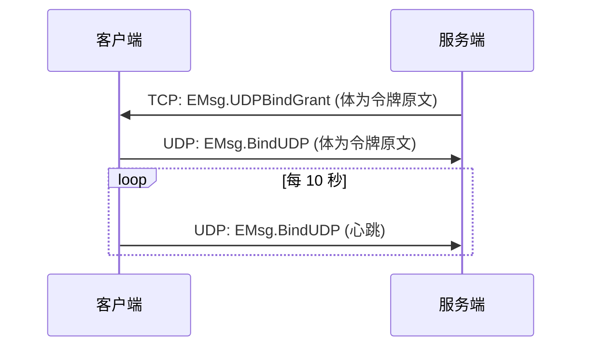

# 网络与会话

## 这篇文档讲什么？

本指南介绍 Network 模块的完整用法，包括连接管理、消息收发、重连机制和会话管理。

**目标读者**：需要理解 Clover 客户端网络层的 Unity 开发者。

## 前置条件

- 已完成 [快速开始](../quickstart.md)
- 了解基本的网络编程概念

## Network 模块概览

客户端引擎的网络底座，与服务端 `event` 内核同语义。

| 能力 | 说明 |
|------|------|
| Connection | 传输抽象与线路计划：QUIC / TCP / WebSocket / 裸 UDP（**WebTransport 尚未实现**，待办由客户端引擎仓库维护）。原生家族 = QUIC → TCP + RawUDP，Web 家族 = WT → WS（两者均需浏览器 jslib 桥接、**当前均未落地 ⇒ WebGL 无可用线路**），**两家族互斥**；跨家族换线不是「降级」而是换协议家族，引擎禁止 |
| Session | 登录态：account / playerID / token / 线路 / requestID 分配 / 请求-回包配对 |
| Router | `OnMsg(msgID, handler)` 注册派发，推送（requestID==0）走这里 |
| Call 配对 | `Call<T>` 按 requestID 配对，超时默认 10s |
| 会话恢复 | 断线重连后自动发送 `EMsg.ResumeSession`。凭证取自全量同步的 `session_token`；服务端回包**必须带 `owner`**，否则网关不会把重连后的新连接绑回 owner，后续业务消息会被**全量拒为 401** |
| 重连 | 次数上限（默认 5）、指数退避（2^n 秒，封顶 60s） |

## 接入地址与端口（这一步必须搞对）

```csharp
Game.Launch(config);
CloverNet.Init("127.0.0.1:8002", "127.0.0.1:8003");
//                  ↑ TCP 网关       ↑ UDP 端点（不需要不可靠通道就传 null）
```

两个参数与服务端 `server.yaml` 的 `gateway` 段**一一对应**：

| 服务端配置 | 端口 | 谁在用 | 客户端参数 |
|-----------|------|--------|-----------|
| `gateway.listen_tcp` | **8002** | Unity 原生客户端（裸 TCP） | `CloverNet.Init` 第 1 个参数 ← **就是这个** |
| `gateway.listen_udp` | 8003 | 不可靠通道（`SendUnreliable`） | 第 2 个参数，不需要就传 `null` |
| `gateway.listen_ws` | 8001 | 浏览器 / WebGL 客户端（WebSocket） | Unity 客户端**不要用** |

### 线路是否走 TLS

服务端配了 `gateway.tls_cert` 后 **TCP 口默认也被 TLS 包起来**（`tcp_tls_disabled` 默认 `false`）；
客户端用 `GameConfig.UseTls` 匹配（`true` → TCP 走 `SslStream`、WS 走 `wss://`、QUIC/WT 本来就是 TLS 1.3）：

```csharp
Game.Launch(new GameConfig
{
    ServerAddr = "127.0.0.1:8002",
    UseTls = true,          // 与服务端 gateway.tcp_tls_disabled 相反：服务端 false 时这里 true
});
```

- **两个开关必须相反**：`UseTls=true` 连明文网关 = 握手失败（连上就断）；`UseTls=false` 连 TLS 网关 = 同样连不上。
- 证书走**系统信任链**校验，引擎**不提供**跳过校验的开关（硬约束 §N7）；本地开发用 mkcert 根 CA（`mkcert -install` 装进信任库）。
- 服务端 TCP/WS 的 TLS 下限是 **1.2**（`gwcore` 为 TCP/WS 单独放宽，QUIC/WT 仍是 1.3），以兼容只到 TLS 1.2 的原生 `SslStream`。
- 服务端显式设 `tcp_tls_disabled: true` 保留明文入口时，启动日志会打一条告警——那不是默认形态。

> ⚠️ Unity 客户端**必须填 8002**（`gateway.listen_tcp`）。填 8001 是常见错误：
> 8001 是 WebSocket 口，裸 TCP 连上去会出现「TCP 握手成功 → 立刻被断开 → 自动重连 →
> 重连耗尽报被踢 → 之后所有 `Call`（登录 / 建房 / 同步）全部超时」这种极难定位的现象。
> 客户端日志特征：`[Network] reliable link connected (…)` 紧跟着 `reliable link lost (…)` /
> `reconnecting in …s`（链路日志由 `Game.Logger` 以 `Network` tag 输出，可在 `logs/` 文件日志里检索）。
>
> 另注：`CloverNet.Init` 的第一个参数缺省（null / 空串）时**会回退读取 `GameConfig.ServerAddr`**；
> 两者都未配置且 `WsAddr` 也为空时才报错返回。

## API 对照

> **注意：** 客户端和服务端的网络 API 语义完全一致，方便前后端逻辑复用。

| 操作 | 服务端 Go | 客户端 C# |
|------|----------|----------|
| 注册监听 | `g.OnMsg(msgID, func(c event.Ctx) error { ... })` | `Game.OnMsg(msgID, ctx => { var r = ctx.Bind<EPlayerFullSyncNotify>(); ... })`（**唯一入口**） |
| 回复 | `g.Reply(c, v)` | - |
| 可靠发送 | - | `Game.Net.Send(EMsg.Xxx, msg)` |
| 请求-回包 | - | `await Game.Net.Call<XxxReply>(EMsg.Xxx, msg)` |
| 非可靠发送 | - | `Game.Net.SendUnreliable(EMsg.Xxx, msg)` |

> **命名一致**：注册监听在两端**同一个名字 `OnMsg`**（服务端 `g.OnMsg` / 客户端 `Game.OnMsg`），
> 且客户端**只有这一个入口**——`INetwork` 不含 `OnMsg/OffMsg`（路由能力独立为 `IRouter`，由 `Game` 门面暴露），
> 所以不存在 `Game.Net.OnMsg` 第二入口，也不存在 `OnPush` 之类的近似名。
> 回包不注册回调——`Call<T>` 按 requestID 自动配对；客户端 router 只会收到推送（回包 msgID 恒为 0，走配对不进 router）。

## 核心 API

### 注册推送监听

```csharp
// 注册监听（唯一入口，与服务端 g.OnMsg 同名）
Game.OnMsg(EMsg.SomeNotify, ctx =>
{
    var msg = ctx.Bind<SomeNotify>();
    Debug.Log($"收到推送: {msg.Data}");
});

// 取消监听
Game.OffMsg(EMsg.SomeNotify, handler);   // 精确移除指定 handler
Game.OffMsg(EMsg.SomeNotify);            // 移除该消息号的全部 handler
```

### 发送消息

```csharp
// 可靠发送（TCP）；业务消息号放 MsgDef，不要混进 EMsg
Game.Net.Send(MsgDef.ChatMessage, new ChatMessage
{
    Content = "你好",
});

// 非可靠发送（UDP 优先）
Game.Net.SendUnreliable(MsgDef.PositionSync, new PositionData
{
    X = transform.position.x,
    Y = transform.position.y,
    Z = transform.position.z,
});
```

### 请求-回包

```csharp
// 异步请求
try
{
    var reply = await Game.Net.Call<ShopBuyReply>(MsgDef.ShopBuy, new ShopBuyRequest
    {
        ItemID = 1001,
        Count = 1,
    });
    Debug.Log($"购买成功: {reply.OrderID}");
}
catch (CloverCallException ex)
{
    Debug.LogError($"业务错误: {ex.ServerError}");
}
catch (TimeoutException)
{
    Debug.LogError("请求超时");
}
```

## Ctx 成员

服务端 `event.Ctx` 的客户端子集：

| 成员 | 说明 |
|------|------|
| `MsgID` | 消息号 |
| `RequestID` | 请求配对 ID |
| `TraceID` | 追踪 ID |
| `Body` | 原始消息体 |
| `Bind<T>()` | 反序列化消息体 |

```csharp
Game.OnMsg(EMsg.SomeNotify, ctx =>
{
    Debug.Log($"MsgID={ctx.MsgID}, RequestID={ctx.RequestID}, TraceID={ctx.TraceID}");
    var msg = ctx.Bind<SomeNotify>();
});
```

## UDP 绑定

绑定两步：



> **警告：** `UDPBindGrant` 由引擎最高优先拦截，业务**不可占用**该消息号。断线时清理 UDP。
>
> 该帧**不加密**（即便已协商会话通道加密）：网关在 `onUDPFrame` 里按明文读令牌，早于任何解密。

## 排队位置通知

服务器限流 / 满载时会把你放进**等候队列**（而不是直接拒绝），并下发 `EMsg.QueuePosition`（=7，
网关直发帧，`requestID=0`，不经逻辑服）。业务据此显示「您前面还有 N 人」的等待界面：

```csharp
Game.Event.On<EQueuePositionNotify>("Net.QueuePosition", pos =>
{
    // ahead / total / ticket；文本刷新由你自己的面板控件完成（IUIManager 不提供 SetText）
    _queueLabel.text = $"前面还有 {pos.ahead} 人";
});

// 也可以只读状态（引擎会维护，任意时刻可查）
if (Game.Net.IsQueued) Debug.Log($"{Game.Net.QueueAhead}/{Game.Net.QueueTotal}");
```

| 项 | 说明 |
|---|---|
| 载体 | `EQueuePositionNotify{ ahead, total, ticket }`（`ahead`=前面还有多少人，0=队首；`ticket`=排队编号，仅展示） |
| 时机 | 入队时下发一次；队列前进后按固定间隔（3s）**只在位置变化时**续发 |
| 放行判据 | 收到**任意回包**即表示已放行（排队中服务端丢弃后续帧、不会有回包）——引擎此时清 `IsQueued` |
| 超时 | 排队期间引擎会顺延未决请求（如登录 `Call`）的超时：服务端还在刷新位置就说明仍在正常排队；**但顺延有总期限**——`MinPendingHardTimeoutSeconds = 60`（实际取 `max(60, CallTimeoutSeconds)`），到点即判超时失败（队列停滞期不下发位置帧时也不会无限挂起） |
| 未启用 | 服务端 `gateway.queue_cap=0`（默认不排队）时**不会出现**该帧：超限直接拒绝并断连 |

## 会话通道加密（AES-256-GCM）

登录后客户端与服务端之间的**整帧**可以再套一层会话加密（TCP/WS 之上、TLS 之内的应用层）：

```text
客户端登录（自动声明 encrypt=true）→ 服务端回包带 session_key（明文）
→ 双方此后所有帧 = [12B nonce][ciphertext+tag]（8B 帧头一起加密）
```

| 项 | 说明 |
|---|---|
| 谁开启 | **引擎自动**：`Game.Net.Call<ELoginReply>(EMsg.Login, …)` 时按平台能力自动填 `ELoginRequest.encrypt`，业务不要手填 |
| 平台不支持 | 拿不到 AES-GCM 的平台（如 WebGL）**不声明**加密 → 服务端保持明文，链路安全由 wss/QUIC/WT 的 TLS 承担（不会出现"声明了却解不开"） |
| 状态查询 | `Game.Net.IsChannelEncrypted` |
| 明文例外 | ① 登录回包自身（客户端要靠它拿密钥）；② `EMsg.BindUDP` 绑定帧（网关按明文读令牌） |
| 断线重连 | 新连接是**新会话**：密钥作废、由新的登录回包重新协商（引擎自动清掉旧密钥） |
| 与 TLS 的关系 | 这是「TLS 之上再加一层」，**不是** TLS 的替代——登录回包本身仍是明文下发密钥 |

## 网络帧格式

### TCP 流

> **QUIC 流的分帧不同**：`[4B 大端长度][客户端帧]`（**无 type 字节**，见 `Runtime/Network/Quic/QuicStreamFraming.cs`）；WebTransport 尚未实现，接入后另行说明。

```
+-------------+-------------------+-------------------+-------------------+---------+
| type (1B)   | length (4B)       | requestID (4B)    | msgID (4B)        | body    |
| 传输层帧类型  | 后续数据字节长度     | 请求配对 ID        | 消息号             | 消息体   |
+-------------+-------------------+-------------------+-------------------+---------+
```

| 字段 | 长度 | 说明 |
|------|------|------|
| `type` | 1 字节 | 传输层帧类型：`0`=数据、`1`=ping、`2`=pong、**`3`=会话迁移（仍在 `Connection.cs`：有常量、有显式 case，收到只打一条 Info，不报错）** |
| `length` | 4 字节 | 其后的 `[requestID][msgID][body]` 字节长度（不含 `type` 与自身） |
| `requestID` | 4 字节 | 请求配对 ID，0 表示推送 |
| `msgID` | 4 字节 | 消息号（EMsg 枚举） |
| `body` | 可变 | 消息体（JSON / Protobuf / MemoryPack，当前默认 JSON） |

### 裸 UDP

```
+--------+-------------------+-------------------+---------+
| 0x55   | requestID (4B)    | msgID (4B)        | body    |
| 魔数    | 请求配对 ID        | 消息号             | 消息体   |
+--------+-------------------+-------------------+---------+
```

| 字段 | 长度 | 说明 |
|------|------|------|
| `0x55` | 1 字节 | 魔数标识 |
| `requestID` | 4 字节 | 请求配对 ID，0 表示推送 |
| `msgID` | 4 字节 | 消息号（EMsg 枚举） |
| `body` | 可变 | 消息体 |

## WebRequest（HTTP 短连接）

版本检查、公告、CDN 清单、日志/埋点上报等一切 HTTP(S) 请求的统一入口。

| 特性 | 说明 |
|------|------|
| 支持方法 | GET / POST |
| 超时 | **已内置固定 10s**（`RequestTimeoutSeconds`，写进每条 `UnityWebRequest.timeout`，见 `Runtime/Network/WebRequest.cs:20`） |
| 重试 / 并发上限 | **未实现**（`IWebRequest` 只有 `Get` / `Post` / `Dispose`，无重试与并发闸门） |

> **注意：** WebRequest **不走游戏长连接**，与 Network 互不干扰。

```csharp
// GET 请求（回调式）
Game.Http.Get("https://api.example.com/version", response =>
{
    if (response.IsSuccess)
    {
        var data = JsonUtility.FromJson<VersionCheckResponse>(response.Text);
        // 处理结果
    }
});

// POST 请求（回调式，body 为 JSON 字符串）
var body = JsonUtility.ToJson(new LoginRequest { Account = "test", Password = "123456" });
Game.Http.Post("https://api.example.com/login", body, response =>
{
    if (response.IsSuccess)
    {
        var data = JsonUtility.FromJson<LoginResponse>(response.Text);
        // 处理结果
    }
});
```

## 局域网寻服（LanBrowser / LanResponder）

找同网段里「谁开了服、能不能进」—— **旁路能力**：走 UDP 广播 / 单播，**不占 EMsg 消息号、不进 Router、不走线路族**（N13），
与服务器端 etcd 服务发现（`internal/app/discovery.go`）无关（不共享协议 / 端口 / 代码）。
仅原生平台可用；WebGL 无 BSD socket ⇒ `IsSupported=false`，`Scan()` 打 Error + 立即 `OnScanFinished`（**禁止静默失败**）。

### 用法三段式

```csharp
Game.Launch(config);                        // 1. 起引擎（CloverLan 随 Launch 自动挂接）
Game.LanBrowser.Scan();                     // 2. 找主机（结果经事件出；Hosts 是最近一轮的只读快照）
// 3. 玩家选一台
CloverNet.Init(host.Address, host.UdpAddress);   // host 来自 OnHostFound
```

> **寻服必须早于 `CloverNet.Init`**：先寻服、选主机，再连；引擎**不提供运行中切服**（`CloverNet.Init` 幂等、只生效一次，见 N1）。

### 发现端（`Game.LanBrowser`，`ILanBrowser`）

| API | 参数 | 返回值 | 说明 |
|-----|------|--------|------|
| `Game.LanBrowser.Scan(options)` | `LanScanOptions` | `void` | 开始新一轮（`null` = 全默认）。扫描中重复调用 = 停旧的、开新的；窗口到点或提前结束都**收尾一次**，调用方不会卡在 `Scanning` |
| `Game.LanBrowser.Stop()` | - | `void` | 提前结束本轮（保留已发现结果）；未在扫描时是幂等空操作 |
| `Game.LanBrowser.Hosts` | - | `IReadOnlyList<LanHostInfo>` | 最近一轮结果（**只读快照**，上限 64 台，同 `gateway` 去重）；新一轮开始时清空 |
| `Game.LanBrowser.State` | - | `LanBrowserState` | `Idle` / `Scanning` |
| `Game.LanBrowser.IsSupported` / `UnsupportedReason` | - | `bool` / `string` | 当前平台能否寻服；不能时给可直接显示给玩家的原因 |
| `Game.LanBrowser.OnHostFound` | `Action<LanHostInfo>` | - | 每发现一台触发一次（主线程；同 gateway 的重复应答只覆盖数据、不重复触发） |
| `Game.LanBrowser.OnScanFinished` | `Action` | - | 一轮结束触发一次（主线程；无论有无结果、任何提前结束路径也一定触发） |

`LanScanOptions`：`Port`（0 = 默认 `47777`）/ `DurationMs`（默认 1500）/ `IncludeBroadcast` / `IncludeSubnetBroadcast` / `IncludeLoopback` / `ExtraTargets`（额外单播目标）。
`LanHostInfo`（只读快照）：`Host` / `GatewayPort` / `UdpPort` / `AuthAddr` / `Name` / `Players` / `MaxPlayers` / `Version` / `Extra`，以及 `Address`（`host:gatewayPort`）/ `UdpAddress`（`UdpPort <= 0` 时为空串）。

### 应答端（`CloverLan.CreateResponder()` → `ILanResponder`）

「我开的主机要被别人扫到」—— `ILanBrowser` 的**对侧**。只有一半时工程里 `Find Servers` 恒为 0 台**不是"没扫到"、是"没人应答"**（现象上与"没有发现能力"无法区分）。
**不经 `Game` 门面、也不要求 `Game.Launch`**：是不是主机是业务决策，不是引擎生命周期的一部分。

| API | 参数 | 返回值 | 说明 |
|-----|------|--------|------|
| `CloverLan.CreateResponder()` | - | `ILanResponder` | 每次返回新实例；**由调用方持有并负责 `Dispose()`**（引擎不代管） |
| `responder.Start(self, options)` | `LanHostInfo, LanRespondOptions` | `bool` | 开始应答（幂等）。已在跑时**只更新广播参数**并返回 `true`（端口不可在运行中更换，打 Warn）；`self.Host` 留空 = 自动取本机一个 IPv4 |
| `responder.Stop()` | - | `void` | 停止（幂等；未启动时空操作） |
| `responder.Describe()` | - | `string` | 一行状态（日志 / 调试面板 / 探针共用） |
| `responder.IsSupported` / `UnsupportedReason` / `IsRunning` / `ListeningPort` / `LastError` | - | `bool` / `string` / `int` | 状态与失败原因（成功后清空） |
| `responder.Self` | - | `LanHostInfo` | 当前对外广播的主机快照（`Start` 后非 null） |
| `responder.QueryCount` / `ReplyCount` / `DroppedCount` | - | `long` | 收到的合法查询数 / 回出的应答数 / 丢弃的非法包数（判据用：`QueryCount > 0` = 确实有人在找服） |
| `responder.OnQuery` | `Action<string>` | - | 每收到一次合法查询触发（主线程；参数 = 来源 `ip:port`），高频查询由实现限频日志 |

```csharp
var responder = CloverLan.CreateResponder();
var self = LanHostInfo.Create("", 8002, 8003, null, "我的服", 1, 10, "1.0.0", null); // Host 留空 = 自动取本机 IPv4
if (!responder.Start(self))
    Game.Logger?.Warn("Lan", $"局域网应答端启动失败：{responder.LastError}");
// ... 主人退出时
responder.Dispose();
```

> 应答端**只管「能被发现」**：应答里广播的 `gateway` 端口是**参数**（调用方给的那台真网关的端口），不是它自己起的服务 ——
> 「列表里看得到、点加入却接不上」= 网关没起来，与本能力无关。
> 四条边界都**不抛**：平台不支持 / 端口被占用 ⇒ `Start` 返回 `false` + `LastError`；重复 `Start` ⇒ 幂等；`Stop` 未启动 ⇒ 空操作。

### 协议与线程模型

- 协议（沿用 `LanProtocol`）：查询 `CLOVER-LAN-QUERY/1|<nonce>` 广播 / 单播到默认端口 **`47777`** → 主机**单播**回应答 `CLOVER-LAN-REPLY/1|{json}`；单包 ≤ **512** 字节；每轮一个 32 字符 hex `nonce`，应答必须回显（防上一轮包串味）；主机地址取报文里的 `gateway`，**不信任来源 IP**。
- 应答端固定监听 `47777`（与发现端的临时端口不同）、**只回给查询来源端点**（不做广播回包，否则 N 台主机互相扫描会变成广播风暴）。
- 线程模型：收包在后台线程（`CloverLan-Udp`）；`State` / `Hosts` / `OnHostFound` / `OnScanFinished` / `OnQuery` 一律经 `Game.Dispatcher.Post` 收敛到主线程（`Game.Dispatcher` 为 null 时直接执行）。公开方法仅主线程可调。
- 事件（经 `Game.Event` 发布，与 C# 事件互为等价入口）：`Net.LanHostFound`（参数 `LanHostInfo`）/ `Net.LanScanFinished`。

## 网络事件

| 事件名 | 说明 |
|--------|------|
| `Net.OnConnected` | 连接建立 |
| `Net.OnDisconnected` | 断开，恢复可用时自动重连 |
| `Net.OnConnectFailed` | 从未连上：首次连接失败或地址非法 |
| `Net.OnKicked` | 重连次数耗尽或无恢复凭证 |
| `Net.OnResumed` | 会话已恢复，参数为回包结构 |
| `Net.OnResumeFailed` | 恢复被拒，参数为原因 |
| `Net.QueuePosition` | 服务器排队位置变化（参数为 `EQueuePositionNotify`，见「排队位置通知」） |

```csharp
// 监听连接事件（OnConnected/OnKicked 无参；OnResumed 带参、用显式 On<T>）
Game.Event.On("Net.OnConnected", () =>
{
    Debug.Log("已连接到服务器");
});

Game.Event.On<EResumeSessionReply>("Net.OnResumed", data =>
{
    Debug.Log("会话已恢复");
});

Game.Event.On("Net.OnKicked", () =>
{
    Debug.Log("被踢出，需要重新登录");
});
```

## 网络硬约束

| 编号 | 约束 |
|------|------|
| **N1** | 单一 `addr = ip:port` 配置；启动自动连接，无手动输入 |
| **N2** | 帧格式 `[4B requestID][4B msgID][body]`，requestID==0 推送 |
| **N3** | EMsg 两端一致：常量名与值逐字相同（服务端 `game/def/` ↔ 客户端 `Runtime/Network/EMsg.cs`（引擎段）与 `MsgDef`（业务段）） |
| **N4** | 重连走 session resume 不重登；次数上限 + 指数退避 |
| **N5** | UDP 绑定两步流程，每 10 秒重报绑定帧 |
| **N6** | QUIC / WebSocket / RawUDP 为 P0 级交付（**WebTransport 未实现**，待办由客户端引擎仓库维护） |
| **N7** | 全场景禁止自签证书 |
| **N8** | WebTransport keepalive（msgID==0 空包）直接丢弃 |
| **N9** | 多设备被踢 → 清理 UDP → 走 `OnKicked`，不自动重连 |
| **N10** | 平台线路：Standalone = QUIC → TCP + RawUDP；GL（WebGL）= **当前无可用线路**（WebSocket 与 WebTransport 均需浏览器 jslib 桥接、尚未落地，待办由客户端引擎仓库维护；浏览器无 BSD socket，原生家族线路也不可用） |
| **N11** | 线路 TLS 开关与服务端 `gateway.tcp_tls_disabled` **必须相反**；证书只走系统信任链（无跳过开关） |
| **N12** | 会话通道加密由引擎协商（登录时自动填 `ELoginRequest.encrypt`）；业务不得手填该字段，也不得自行加解密帧 |
| **N13** | 局域网寻服（`LanBrowser` / `LanResponder`）是**旁路协议**：不占 EMsg 消息号、不进 Router、不走线路族，与服务器端 etcd 服务发现无关。仅原生平台可用（WebGL 无 BSD socket ⇒ `IsSupported=false`，禁止静默失败）。使用顺序固定为「`Game.Launch` → `Game.LanBrowser.Scan` → 选主机 → `CloverNet.Init(主机 Address)`」；引擎不提供运行中切服（`CloverNet.Init` 幂等，见 N1）。应答端经 `CloverLan.CreateResponder()` 取得，固定监听 UDP `47777`、只单播回查询来源、`Start`/`Stop` 幂等且四条边界都不抛 |

## 常见问题

### 连接超时

**症状**：`TimeoutException`

**原因**：网络不稳定或服务器负载过高

**解决**：
1. 检查网络连接
2. 增加 `CallTimeoutSeconds` 配置

### 局域网扫描 0 台结果

**症状**：`Game.LanBrowser.Scan()` 收尾了，`Hosts` 是空的，也没有任何报错。

**原因**（按可能性排序）：
1. 同网段里**没有主机在应答** —— 只有"问"的一半时（没人调 `CloverLan.CreateResponder().Start(...)`），
   0 台**不是"没扫到"、是"没人应答"**，与"没有发现能力"在现象上无法区分；
2. 系统防火墙拦下了 UDP `47777` 的入站（主机侧收不到查询）；
3. 当前平台不支持（WebGL 无 BSD socket）—— 但这条会打 Error 日志 + `IsSupported=false`，可据此排除。

**解决**：
1. 在主机侧起应答端并**用它的计数当判据**：`responder.QueryCount > 0` = 确实有人在找服（若 `QueryCount` 在涨而 `ReplyCount` 不涨，看 `LastError` 与 `DroppedCount`）；
2. 在目标机放行入站 UDP `47777`；
3. 真机（非编辑器）复测：编辑器里子网广播在部分 VPN / 虚拟网卡环境下会被路由吞掉，用 `LanScanOptions.ExtraTargets` 指定主机 IP 单播可先验证链路。

### 会话恢复失败

**症状**：`Net.OnResumeFailed` 事件触发

**原因**：服务器会话过期或 token 无效

**解决**：
1. 重新登录
2. 检查 token 是否正确

> ⚠️ **另一种「看起来恢复了、其实废了」**：`Net.OnResumed` 正常触发，但紧接着**每条业务请求都返回
> `code=401 unauthenticated`**。这不是网络抖动，而是**网关没把 owner 绑到重连后的新连接**上
> （恢复回包缺 `owner` 字段）。**补 `owner` 是服务端/网关的职责**（`EResumeSessionReply.owner` 的语义就是
> "服务端在恢复会话时下发、供网关把新连接绑回原 owner"）；
> ⛔ 客户端引擎里**没有** `ResumeSessionHandler` 这个组件（全仓 0 命中）—— 别去找它；
> 业务侧若遇到，监听 `Net.OnUnauthorized` 回登录流程即可，不要当成弱网重试。

## 下一步

1. 了解 [序列化协议](./serialization.md) 和帧格式
2. 了解 [Game 门面](./game-facade.md) 和模块入口

