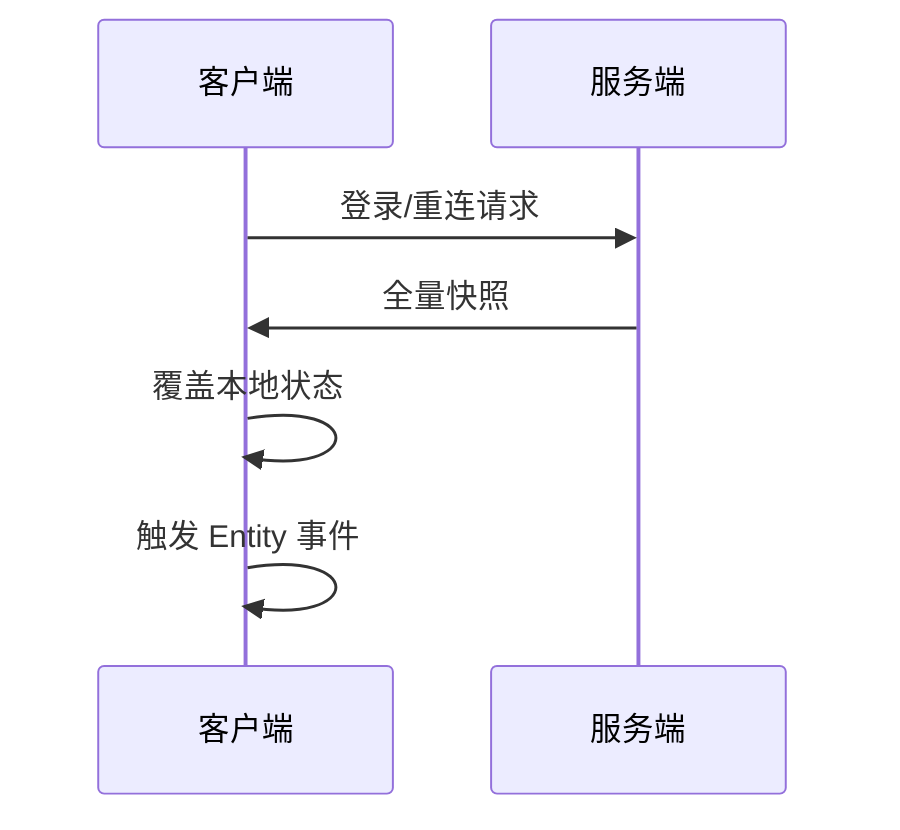

# WorldSync 世界同步

## 这篇文档讲什么？

本指南介绍 WorldSync 世界同步模块，将服务器 MMO/AOI 数据同步到客户端。

**目标读者**：需要实现多人在线游戏的 Unity 开发者。

## 前置条件

- 已完成 [快速开始](../quickstart.md)
- 了解 [网络与会话](./network.md)
- 了解 [Entity 与 View](./entity-view.md)

## 核心能力

> **注意：** 业务拿到的是"已经在本地的世界"，无需关心同步细节。

| 能力 | 说明 |
|------|------|
| 实体镜像 | 服务器 AOI 进出/移动/属性事件 → 本地业务回调（`OnEntityEnter` / `OnEntityLeave` / `OnEntityMove` / `OnEntityProperty`） |
| 数据订阅 | 全量（登录后一次，`OnFullSync`）+ 增量（`OnData`），动态 map 经 MiniJson 解析 |
| 位置插值 | 服务端**离散**坐标 → 本地每帧指数平滑，用 `TryGetPosition` 读取（**只有这一个实现，没有档位**） |
| 快照对齐 | 登录 / 重连 resume 后，服务器快照整体覆盖本地 |
| 帧同步管道 | 房间帧同步：上行发输入、下行收帧广播按帧推进（`Game.FrameRoom`） |

> 关于「表现事件」：buff / 技能 / 受击 / 飘字这类纯表现推送**不在 WorldSync 范围内**，
> 走各业务自己的消息号 + `Game.OnMsg`，由引擎的业务消息通道分发。

## 位置插值（唯一实现）

服务端位置是**离散**下发的（约 10Hz 量级），直接贴到 Transform 会看到明显抖动。
引擎的做法是每帧把实体位置**指数平滑**逼近服务端给的目标：

- 目标值：由 `OnEntityEnter`（进入即贴合，不从原点飞过去）与 `OnEntityMove` 写入；
- 推进：`Game.Tick` 每帧调 `Sync.Tick(dt)`，按 `dt * 10` 的混合系数逼近目标；
- 读取：`Game.Sync.TryGetPosition(id, out x, out y, out z)`。

**分工（别用错）**：

| 用途 | 用哪个 |
|------|--------|
| 驱动表现（Transform / 骨骼朝向） | `TryGetPosition`（平滑值，每帧轮询） |
| 逻辑判定（追及、命中、距离） | `OnEntityMove` 的目标坐标（权威值，离散回调） |

> ⚠️ **没有本地预测 / 回滚 / 死推**：本引擎是「服务端权威 + 客户端插值」的单一实现，
> 不存在可切换的预测档位，也没有 `MoverView` 之类的可插拔预测模块。
> 若玩法确需本地预测，需要自行实现（输入即时生效 + 服务端回执校正），引擎不提供。

### 使用示例

```csharp
// 实体移动：只记录「权威目标位置」用于逻辑判断（不要直接贴给 Transform，会抖）。
// 注意：EntityInfo 上**没有** TargetPosition 字段（引擎只保证 ObjectID / TypeID / SceneGroup
// 三个只读字段），权威目标要由**业务自建的 View / 数据包装类型**保存。
Game.Sync.OnEntityMove((entityId, x, y, z) =>
{
    var view = myViews.Get(entityId);                  // 业务自己的 View / 包装
    if (view == null) return;
    view.AuthoritativeTarget = new Vector3(x, y, z);
});

// 表现层：每帧读插值后的位置驱动 View（Game.Tick 已在每帧推进插值）
private void Update()
{
    if (Game.Sync.TryGetPosition(_entityId, out var x, out var y, out var z))
        _view.transform.position = new Vector3(x, y, z);
}

// 监听实体属性变更（IWorldSync.OnEntityProperty 回调）
Game.Sync.OnEntityProperty((entityId, attrName, value) =>
{
    var entity = Game.Entity.Get(entityId);
    if (entity == null) return;

    // 更新业务自建的属性缓存（EntityInfo 不含属性集、字段全部只读，不能写回引擎）
    _attrsByEntity[entityId][attrName] = value;
});
```

## 快照对齐规则

> **警告：** 登录/重连 resume 后，服务器快照**整体覆盖**本地，禁止增量硬拼。

### 对齐流程



### 使用示例

```csharp
// 监听全量同步（IWorldSync.OnFullSync 回调）
Game.Sync.OnFullSync((data, accountData) =>
{
    // 服务器快照会自动覆盖本地
    // 业务只需通过回调处理即可
    Game.Logger?.Info("WorldSync", $"收到全量同步: {data.Count} 个数据桶");
});

// 监听 Entity 进入/离开（IWorldSync.OnEntityEnter/OnEntityLeave）
Game.Sync.OnEntityEnter((entityId, attrs) =>
{
    Game.Logger?.Info("WorldSync", $"新实体进入视野: {entityId}");
});

Game.Sync.OnEntityLeave((entityId) =>
{
    Game.Logger?.Info("WorldSync", $"实体离开视野: {entityId}");
});

// 取消订阅：每个 On* 都有配对的 Off*，传注册时的同一委托引用即可精确移除
Action<string, object> onData = HandleData;
Game.Sync.OnData(onData);
Game.Sync.OffData(onData);

// 或在场景切换 / 登出时一次清空全部回调（不影响引擎内部注册的推送处理器）
Game.Sync.Clear();
```

## 表现事件

buff/技能/受击/飘字只做表现回照，不算数值。

```csharp
// 通过 IWorldSync.OnData 监听表现事件（buff/技能/受击等）
Game.Sync.OnData((type, value) =>
{
    var body = value as Dictionary<string, object>;
    if (body == null) return;
    
    switch (type)
    {
        case "buff_apply":
            // 播放 buff 特效
            PlayBuffEffect(body);
            break;
        case "skill_cast":
            // 播放技能动画
            PlaySkillAnimation(body);
            break;
        case "hit":
            // 显示伤害飘字
            ShowDamageNumber(body);
            break;
    }
});
```

## 帧同步管道

房间帧同步：上行发输入，下行收帧广播按帧推进。

> **注意：** 帧同步**不由 `IWorldSync.OnData` 手工分桶处理**，而是走引擎内置的 `Game.FrameRoom`（`IFrameRoom`）。
> 引擎按房间消息号注册处理器并解析帧数据，业务只订阅 `OnFrame` / `OnClosed` / `OnTakeover`。
> 消息号由业务通过 `Configure()` 注入，引擎层不含业务消息号。

```csharp
// 1. 注入业务消息号（初始化一次，必须在首次使用前）
Game.FrameRoom.Configure(MsgDef.GetFrameRoomMsgIds());

// 2. 订阅帧推进 / 房间关闭 / 隔线接管
Game.FrameRoom.OnFrame += frame => { /* 按帧执行 lockstep 模拟 */ };
Game.FrameRoom.OnClosed += (roomId, frame, reason) => { /* 房间关闭 */ };
Game.FrameRoom.OnTakeover += pack => { /* 重连并恢复 */ };

// 3. 上行发输入（帧号可由服务端分配）
Game.FrameRoom.SendInput(JsonUtility.ToJson(input));
```

## 最佳实践

> **警告：** 以下是 WorldSync 开发的最佳实践：

1. **不要手动修改远端实体位置**：远端实体位置由 WorldSync 管理，业务只读
2. **使用 IWorldSync 回调**：通过 OnEntityMove/OnEntityProperty/OnEntityEnter/OnEntityLeave 监听实体状态变化
3. **表现与数据分离**：EntityInfo 只存数据（ObjectID / TypeID / SceneGroup 只读快照，**无 Attrs 字典**），View 负责表现
4. **帧同步走 `Game.FrameRoom`**：不要用 `IWorldSync.OnData` 手工分桶；实体/AOI 事件才走 `IWorldSync`
5. **数据订阅只有 `Game.Sync` 一个入口**：`OnData`（增量，按 type 自行分派）+ `OnFullSync`（全量）。`Game.Schema` 只登记字段结构，不做订阅（避免两套入口）

## 常见问题

### 实体位置不同步

**症状**：客户端位置与服务器不一致

**原因**：网络延迟或同步事件未正确处理

**解决**：
1. 检查 `IWorldSync.OnEntityMove` 回调是否正确注册
2. 确认实体 ID 匹配（entity_id / object_id / id 三种字段名均支持）

### 快照对齐失败

**症状**：重连后状态不一致

**原因**：本地状态未正确覆盖

**解决**：
1. 确保监听 `IWorldSync.OnFullSync` 回调（登录后推送一次全量数据）
2. 检查本地状态清理逻辑

## 下一步

1. 了解 [Entity 与 View](./entity-view.md) 和数据绑定
2. 了解 [Event / Timer / Fsm](./event-timer-fsm.md) 详细用法

