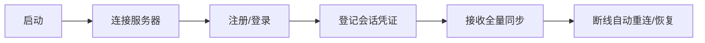

# 登录流程示例

本文档展示一个完整的登录/注册/会话建立/全量同步与断线恢复的接入示例，帮助你快速理解客户端引擎的核心 API 用法。

> **注意：** 源码位置：[`clover-client-unity-engine/Samples~/LoginFlow/`](https://github.com/qw576483/clover-client-unity-engine/tree/main/Samples~/LoginFlow)（可运行样例，本文与之对齐）
>
> ⚠️ **本文是「引擎自带样例」的说明**：样例挂在任意 Unity 工程里演示 API，没有自己的 `Assets/Configs/`，
> 因此服务器地址 / 账号服地址用 **Inspector 字段**（可在面板里改）。
> **业务工程必须把地址写进 `Assets/Configs/config.json` 并由加载器读取**，不要在代码里写地址字面量
> —— 配置说明见 [账号服登录](../development/auth.md) 的「配置示例（`config.json`）」一节。


## 流程概览



## 完整代码

```typescript C#
using System.Collections.Generic;
using CloverEngine;
using UnityEngine;

public class LoginFlow : MonoBehaviour
{
    public string serverAddr = "127.0.0.1:8002";   // 网关 TCP 口
    public string udpAddr = "127.0.0.1:8003";      // 网关 UDP 口，留空=不启用
    public bool useTls = true;                    // 与服务端 gateway.tcp_tls_disabled 相反
    public string authAddr = "http://127.0.0.1:8051"; // 账号服地址（必填；与引擎样例 Samples~/LoginFlow 一致）
    public string account = "player1";
    public string password = "123456";
    public int line;

    private ELoginReply _loginReply;

    void Start()
    {
        // 第一步：启动引擎（仅初始化日志/设置/事件/定时器等基础设施，不联网）
        Game.Launch(new GameConfig
        {
            ServerAddr = serverAddr,
            UseTls = useTls,          // 与服务端 gateway.tcp_tls_disabled 相反
            CallTimeoutSeconds = 10,
            MaxReconnectCount = 5,
        });

        // 第二步：初始化网络（建立 TCP 连接；UDP 在登录后凭令牌自动绑定）
        // HTTP 模块（账号服登录依赖）也随这行一并挂接，无需单独初始化
        CloverNet.Init(serverAddr, string.IsNullOrEmpty(udpAddr) ? null : udpAddr);
        // 账号服地址为必填配置：为空即配置错误，必须明确失败，不能静默继续
        // （业务工程请从 config.json 的 server.auth_addr 读取，不要写字面量）
        CloverAuth.AuthAddr = authAddr;
        if (!CloverAuth.Enabled)
        {
            // 注意：Game.Logger 由 Game.Launch 初始化；若本段写在 Launch 之前，
            // 必须用 Debug.LogError（Game.Logger?. 会被 null 条件运算符静默吞掉）。
            Debug.LogError("[LoginFlow] 未配置账号服地址，登录 / 注册不可用");
            return;
        }

        // 第三步：订阅网络生命周期事件（NetworkManager 保证回调在主线程）
        Game.Event.On("Net.OnConnected", () => Debug.Log("已连接"));
        Game.Event.On("Net.OnDisconnected", () => Debug.Log("连接断开，自动重连中"));
        Game.Event.On("Net.OnConnectFailed", () => Debug.Log("首次连接失败"));
        Game.Event.On("Net.OnKicked", () => Debug.Log("被踢下线，会话失效"));
        Game.Event.On<EResumeSessionReply>("Net.OnResumed",
            reply => Debug.Log($"会话已恢复: {reply.player_id}"));
        Game.Event.On<string>("Net.OnResumeFailed",
            reason => Debug.Log($"会话恢复失败: {reason}"));

        // 第四步：订阅业务数据同步（全量 + 增量）
        Game.Sync.OnFullSync(OnFullSync);
        Game.Sync.OnData(OnDataSync);

        LoginAsync();
    }

    async void LoginAsync()
    {
        try
        {
            // ① HTTP：账号服校验账号密码，返回 JWT
            var token = await CloverAuth.LoginAsync(account, password);
            // ② 长连接：把 token 交给游戏服，游戏服调账号服 /auth/verify 换 owner
            var reply = await Game.Net.Call<ELoginReply>(
                EMsg.Login, new ELoginRequest { token = token });
            _loginReply = reply;
            if (reply.success)
            {
                // 登记会话凭证：断线后才能自动提交 ResumeSession 恢复。
                // 第 2 个参数**传 null，不是 reply.session_key**（与样例源码 LoginFlow.cs 一致）：
                // session_key 是会话通道加密密钥，当恢复凭证会让恢复会话 token mismatch 被踢；
                // 真正的 session_token 由 PushPlayerFullSync 下发并被引擎自动写入会话。
                Game.Net.SetupSession(account, null, line);
                Game.Logger?.Info("Login", $"登录成功: {reply.owner}");
            }
            else
            {
                Game.Logger?.Warn("Login", $"登录失败: {reply.err}");
            }
        }
        catch (System.Exception ex)
        {
            Game.Logger?.Error("Login", $"登录异常: {ex.Message}");
        }
    }

    void OnFullSync(Dictionary<string, Dictionary<string, object>> data,
        Dictionary<string, object> accountData)
    {
        Game.Logger?.Info("Sync", $"全量同步完成: {data.Count} 类数据");
    }

    void OnDataSync(string type, object value)
    {
        Game.Logger?.Info("Sync", $"增量同步: type={type}");
    }

    void OnDestroy() => Game.Shutdown();
}
```

## 关键步骤说明

### 1. 启动引擎

```typescript C#
var config = new GameConfig
{
    ServerAddr = "127.0.0.1:8002",     // 服务器地址
    MaxReconnectCount = 5,             // 最大重连次数
    CallTimeoutSeconds = 10,           // 请求超时时间（秒）
};
Game.Launch(config);
```

> `Game.Launch` **只**初始化核心子系统（日志 / 派发 / 事件 / 定时器 / 状态机 / 设置）并启动驱动器；
> 它**不联网、不登录、不进场景**。联网由 `CloverNet.Init` 负责。

### 2. 初始化网络

```typescript C#
CloverNet.Init("127.0.0.1:8002", "127.0.0.1:8003");
// 参数1：TCP 地址（网关 gateway.listen_tcp，默认 8002）
// 参数2：UDP 地址（网关 gateway.listen_udp，默认 8003；传 null 表示不启用）
// HTTP 模块随 Init 一并挂接（账号服登录依赖它），无需另行初始化
```

### 3. 登录请求与登记会话

```typescript C#
// ① HTTP：账号服是登录链路的必经依赖，先经 HTTPS 换取 JWT。
// 这一步失败（密码错 / 账号服不可达）直接抛异常，无需再发长连接请求。
var token = await CloverAuth.LoginAsync("player1", "123456");

// ② 长连接：把 token 交给游戏服，游戏服调账号服 /auth/verify 换 owner
var reply = await Game.Net.Call<ELoginReply>(
    EMsg.Login, new ELoginRequest { token = token });

// ★ 必须登记会话，否则断线后不会自动 ResumeSession
//   第 2 个参数**传 null，不是 reply.session_key**（与样例源码一致）：session_key 是通道加密密钥、
//   不是恢复凭证；真正的凭证由全量同步下发的 session_token 覆盖（引擎自动写入，非空覆盖）。
Game.Net.SetupSession("player1", null, line);
```

> 回包类型是 `ELoginReply`（不是 `LoginReply`），字段为 `owner` / `token` / `success` / `err` / `session_key`，
> **没有** `PlayerID` 字段；玩家 ID 在 `Game.Sync` 的全量同步或 `Game.Net.Session.PlayerID` 中获取。
>
> ⚠️ `session_key` 是**会话通道加密密钥**（AES-256 的 base64；客户端声明 `encrypt` 时服务端才下发，
> 支持 AES-GCM 的平台登录后都有值），由引擎自动消费——**别把它当断线恢复凭证**；
> 恢复凭证是 `PushPlayerFullSync.session_token`，引擎会自动写入会话。业务侧无需读它，只可用
> `Game.Net.IsChannelEncrypted` 判断本次连接是否已加密。

### 4. 注册（走账号服 HTTP）

注册是**账号服的职责**，游戏服不接收注册报文——客户端也不该向游戏服发注册消息
（原 `EMsgSignup`=1 号位已作废保留，发出去会被登录门禁直接挡下，只剩「没有 handler」这一结果）。
注册成功即签发 token（注册即登录），直接接上正常的两步登录：

```typescript C#
try
{
    await CloverAuth.SignupAsync(account, password);   // 走账号服 /auth/signup，成功即签发 token
    LoginAsync();                                      // 注册成功自动登录（复用上面的两步登录）
}
catch (System.Exception ex)
{
    Game.Logger?.Error("Signup", $"注册异常: {ex.Message}");
}
```

> 与样例 `LoginFlow.cs` 的 `SignupAsync()` 对齐：注册只经账号服 HTTP，成功后回调 `LoginAsync()`。

### 5. 错误处理

```typescript C#
var request = new ELoginRequest { token = token };   // token 来自上一步 CloverAuth.LoginAsync
try
{
    var reply = await Game.Net.Call<ELoginReply>(EMsg.Login, request);
}
catch (CloverCallException ex)
{
    // 服务端错误回包（EMsg.Error）：按 Code 分支，不要匹配 ServerError 文案
    if (ex.Code == ErrCode.Unauthenticated) { /* 回到登录流程 */ }
    Game.Logger?.Error("Login", $"服务端拒绝: {ex.ServerError} (code={ex.Code})");
}
catch (System.TimeoutException)
{
    Game.Logger?.Error("Login", "请求超时，请重试");
}
catch (System.Exception ex)
{
    // 连接异常等其他问题
    Game.Logger?.Error("Login", $"请求失败: {ex.Message}");
}
```

> 服务端错误回包会以 `CloverCallException`（`Runtime/Network/NetworkManager.cs`）结束任务，
> 它同时带 `ServerError`（人类可读描述）与 `Code`（机器可读错误码，见 `ErrCode`）。
> **按 `Code` 分支**——文案会变，码不会。`code=401` 时引擎还会额外发布
> `Net.OnUnauthorized` 事件，业务可统一在这里回到登录流程。

## 导入示例

1. 打开 Unity Package Manager
2. 点击 `com.clover.unity-engine` 包
3. 点击 **Samples** 标签
4. 点击 **LoginFlow** 的 **Import** 按钮

## 下一步

1. **先补机制**：[网络与会话](../development/network.md) —— 连接管理、消息收发、重连与会话恢复（本页只走了一条链路，这里讲全）
2. **再看门面**：[Game 门面](../development/game-facade.md) —— 引擎初始化次序与各模块入口
3. **上线前**：[硬约束](../reference/constraints.md) —— 必须守住的边界与静默失败风险


