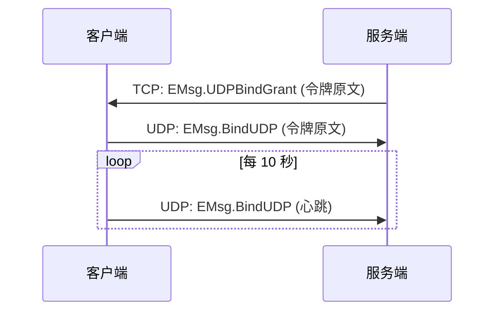

## 这篇文档讲什么？

本文档定义客户端与服务器之间的网络帧格式，所有网络通信必须遵循此格式。帧格式采用**大端字节序**（Big-Endian），与服务端对齐。

## 前置条件

- 已了解 Clover 引擎的基本架构
- 已完成客户端开发环境配置
- 已阅读网络通信基础文档

## 帧格式概览

### 帧结构对比

| 传输协议 | 帧结构 | 说明 |
|----------|--------|------|
| TCP | `[1B type][4B length][客户端帧]` | type 区分数据/心跳；length 防粘包；**单帧 payload 上限 10 MiB**（超硬限直接断线） |
| QUIC 流 | `[4B length][客户端帧]` | **没有 `type` 字节**；与服务端 `internal/transport/net/quic/conn.go` 的 `[4B 大端长度][客户端帧]` 严格对应 |
| 裸 UDP | `[1B 0x55][4B requestID][4B msgID][body]` | 使用魔数标识，天然分包 |
| WebSocket | `[4B requestID][4B msgID][body]`（**一条二进制消息 = 一个客户端帧**） | 无 `type` / `length` 前缀、无 0x55 魔数；文本帧按服务端语义丢弃 |
| WebTransport | **尚未实现**（待办由客户端引擎仓库维护） | 接入后由协议自动处理帧格式 |

> 上表的**客户端帧** = `[4B requestID][4B msgID][body]`（全大端）。

> **帧 / 消息大小上限（三条线路统一 10 MiB）**：客户端帧体上限 `ClientFrame.MaxBodySize = 10 << 20`（TCP/WS 共用），
> TCP 传输层 payload 软限 `MaxFramePayload` / 硬限 `HardMaxFramePayload`、WS 单消息软限 `MaxMsgPayload` /
> 硬限 `HardMaxMsgPayload`、QUIC 单帧 `MaxFrameSize` 亦为 `10 << 20`。`body` 超过 `ClientFrame.MaxBodySize` 时
> `ClientFrame.Encode` **抛 `ArgumentException`**（本地先拦，否则超限帧发出去只会被服务端拒绝/断连，只能看到「连接已断开」）；
> 传输层超过硬上限则**直接断线**。本组常量是**跨端约定**（对应服务端 `max_frame_size` / `maxQUICFrameSize`），改前必须双端确认。

## TCP / QUIC 流

TCP 传输使用以下传输层帧（`payload` 即客户端帧）：

```
+--------+-------------------+-------------------+-------------------+---------+
| type   | length (4B)       | requestID (4B)    | msgID (4B)        | body    |
| 帧类型  | 后续数据字节长度     | 请求配对 ID        | 消息号             | 消息体   |
+--------+-------------------+-------------------+-------------------+---------+
```

> **QUIC 流不同**：帧形状为 `[4B 大端长度][4B requestID][4B msgID][body]`——**没有 `type` 字节**；
> 保活帧是长度为 8 的空请求帧（`requestID=0` + `msgID`），不是空帧。

### 字段说明

| 字段 | 长度 | 类型 | 说明 |
|------|------|------|------|
| `type` | 1 字节 | byte | 帧类型：0=Data, 1=Ping, 2=Pong（原 3=Migrate 已删除，收到按未知帧类型处理） |
| `length` | 4 字节 | uint32 | 后续数据的字节长度（不含自身，含 requestID+msgID+body）；**也是帧上限的判据**——超过 10 MiB 直接断线 |
| `requestID` | 4 字节 | uint32 | 请求配对 ID，0 表示推送 |
| `msgID` | 4 字节 | uint32 | 消息号（EMsg 枚举） |
| `body` | 可变 | byte[] | 消息体（当前默认 JSON） |

> **警告：**   `length` 字段用于防止 TCP 粘包，**必须**正确设置。错误的长度会导致解析失败。
> 它同时承担**帧上限校验**：`body` 超过 `ClientFrame.MaxBodySize`（10 MiB）时 `ClientFrame.Encode` 抛
> `ArgumentException`；传输层 payload 超过硬上限（10 MiB）则直接断线。

### 长度计算

```csharp 标题：长度计算示例
// 传输层帧总长度 = 1 (type) + 4 (length) + 4 (requestID) + 4 (msgID) + body.Length
int frameLength = 13 + body.Length;

// length 字段值 = 4 (requestID) + 4 (msgID) + body.Length
int lengthValue = 8 + body.Length;

// 验证
Debug.Log($"帧总长度: {frameLength}");
Debug.Log($"length字段值: {lengthValue}");
Debug.Log($"body长度: {body.Length}");
```

## 裸 UDP

UDP 传输使用以下帧格式：

```
+--------+-------------------+-------------------+---------+
| 0x55   | requestID (4B)    | msgID (4B)        | body    |
| 魔数    | 请求配对 ID        | 消息号             | 消息体   |
+--------+-------------------+-------------------+---------+
```

### 字段说明

| 字段 | 长度 | 类型 | 说明 |
|------|------|------|------|
| `0x55` | 1 字节 | byte | 魔数标识，用于快速识别 UDP 包 |
| `requestID` | 4 字节 | uint32 | 请求配对 ID，0 表示推送 |
| `msgID` | 4 字节 | uint32 | 消息号（EMsg 枚举） |
| `body` | 可变 | byte[] | 消息体（当前默认 JSON） |

> **注意：**   UDP 天然分包，无需 `length` 字段。魔数 `0x55` 用于快速识别有效数据包。

### 魔数验证

```csharp 标题：魔数验证示例
public class UDPParser : MonoBehaviour
{
    public bool IsValidUDPPacket(byte[] data)
    {
        if (data.Length < 9)  // 最小长度: 1 (魔数) + 4 (requestID) + 4 (msgID)
        {
            return false;
        }
        
        // 检查魔数
        return data[0] == 0x55;
    }
    
    public UDPFrame ParseUDPPacket(byte[] data)
    {
        if (!IsValidUDPPacket(data))
        {
            throw new InvalidDataException("无效的UDP数据包");
        }
        
        var frame = new UDPFrame();
        
        // 解析魔数（已验证）
        frame.Magic = data[0];
        
        // 解析 requestID / msgID：线协议为大端序，**不能使用 BitConverter**（小端平台会读反）
        frame.RequestID = ((uint)data[1] << 24) | ((uint)data[2] << 16) | ((uint)data[3] << 8) | data[4];
        frame.MsgID = ((uint)data[5] << 24) | ((uint)data[6] << 16) | ((uint)data[7] << 8) | data[8];
        
        // 解析 body
        if (data.Length > 9)
        {
            frame.Body = new byte[data.Length - 9];
            Array.Copy(data, 9, frame.Body, 0, frame.Body.Length);
        }
        else
        {
            frame.Body = Array.Empty<byte>();
        }
        
        return frame;
    }
}
```

## requestID 语义

| requestID | 说明 | 使用场景 |
|-----------|------|----------|
| `0` | 服务端推送，无需回复 | 服务器主动推送消息 |
| `> 0` | 请求-回包配对，客户端生成，服务端原样返回 | 客户端请求，等待回复 |

### requestID 生成规则

```csharp 标题：requestID生成示例
public class RequestIDGenerator
{
    private uint _nextID = 1;
    private readonly object _lock = new object();
    
    public uint Generate()
    {
        lock (_lock)
        {
            uint id = _nextID;
            _nextID++;
            
            // 防止溢出
            if (_nextID == 0)
            {
                _nextID = 1;
            }
            
            return id;
        }
    }
}
```

### requestID 使用示例

```csharp 标题：requestID使用示例
public class RequestResponseExample : MonoBehaviour
{
    private Dictionary<uint, Action<byte[]>> _pendingRequests = new Dictionary<uint, Action<byte[]>>();
    private RequestIDGenerator _idGenerator = new RequestIDGenerator();
    
    public void SendRequest(uint msgID, byte[] body, Action<byte[]> onResponse)
    {
        // 生成 requestID
        uint requestID = _idGenerator.Generate();
        
        // 保存回调
        _pendingRequests[requestID] = onResponse;
        
        // 构造帧
        byte[] frame = BuildFrame(requestID, msgID, body);
        
        // 发送
        SendFrame(frame);
    }
    
    public void OnReceiveFrame(byte[] frame)
    {
        // 解析帧
        uint requestID = ParseRequestID(frame);
        uint msgID = ParseMsgID(frame);
        byte[] body = ParseBody(frame);
        
        // 检查是否为回包
        if (requestID != 0 && _pendingRequests.TryGetValue(requestID, out var callback))
        {
            // 执行回调
            callback(body);
            
            // 移除待处理请求
            _pendingRequests.Remove(requestID);
        }
        else if (requestID == 0)
        {
            // 推送消息
            HandlePushMessage(msgID, body);
        }
    }
}
```

## UDP 绑定流程

UDP 绑定采用两步流程：



### 绑定流程详解

1. **服务端下发授权**：通过 TCP 发送 `EMsg.UDPBindGrant` 消息，包含绑定令牌（体为令牌 UTF-8 原文，非 JSON）
2. **客户端上报绑定**：通过 UDP 发送 `EMsg.BindUDP` 消息，携带相同的绑定令牌（同为令牌原文）
3. **心跳维持**：客户端每 10 秒通过 UDP 重报绑定帧，维持绑定状态（兼 NAT 保活）

> **警告：**   `EMsg.UDPBindGrant` 与 `EMsg.BindUDP` 由引擎最高优先拦截，业务**不可占用**这两个消息号。

### 另一类网关直发帧：排队位置（`EMsg.QueuePosition = 7`）

服务器限流 / 满载时会先把连接放进**等候队列**（`gateway.queue_cap > 0`），此时网关不经逻辑服
直接下发 `EMsg.QueuePosition`（`requestID=0`，体为 `EQueuePositionNotify{ahead,total,ticket}`）：

- 入队时下发一次；队列前进后按固定间隔（3s）**只在位置变化时**续发；
- 客户端侧同样是"最高优先拦截"：不进回包配对、不走业务路由，落到
  `Game.Net.IsQueued / QueueAhead / QueueTotal` 并发 `Net.QueuePosition` 事件；
- 排队期间服务端**丢弃后续帧**，因此"收到任意回包"即表示已被放行；引擎会在此期间顺延未决请求的超时，
  但顺延**有总期限**（`MinPendingHardTimeoutSeconds = 60`，实际取 `max(60, CallTimeoutSeconds)`），到点即判超时失败 —— 队列停滞期不下发位置帧时也不会无限挂起。

> `queue_cap` 未启用（默认 `0`）时不会出现本帧：超限连接直接被关闭。

### 绑定流程代码示例

```csharp 标题：UDP 绑定流程（引擎自动完成，业务只读状态）
// UDP 绑定两步全部由引擎在 NetworkManager 内部自动完成，业务无需（也不要）手写：
//   ① 登录后服务端经 TCP 下发 EMsg.UDPBindGrant（体为令牌 UTF-8 原文，非 JSON）；
//   ② 引擎自动经 UDP 上报 EMsg.BindUDP（体为同一令牌原文），并每 10 秒重报（兼 NAT 保活）。
//
// 业务侧只读绑定状态即可：
bool bound = Game.Net.IsUdpBound;
//
// 注意：EMsg.UDPBindGrant（号 6）在保留段 [1,10000] 内，Game.OnMsg 会拒绝注册；
// 帧体为令牌原文，没有可 ctx.Bind<T>() 的类型——不要手动接管这段流程。
```

## 特殊消息

| 消息 | 说明 | 处理方式 |
|------|------|----------|
| **WebTransport keepalive** | msgID == 0 空包，直接丢弃不进 Router | 引擎自动处理 |
| **EMsg.Error** | 统一错误回包，body 为 `EErrorReply{err, code}`。来源两处：逻辑服 handler 返回 error、网关登录门禁拒绝未登录连接 | 引擎按 requestID 结束该次 `Call`（抛 `CloverCallException`，含 `Code`）；`code=401` 时额外发布 `Net.OnUnauthorized` |

### 错误消息处理

```csharp 标题：错误消息处理示例
public class ErrorHandler : MonoBehaviour
{
    void Start()
    {
        // 推荐：订阅引擎归一化后的「未认证」事件（网关门禁 / 逻辑服 401 都会触发它）
        Game.Event.On<EErrorReply>("Net.OnUnauthorized", e =>
        {
            Game.Logger?.Warn("Net", $"未认证（code={e.code}）: {e.err}");
            BackToLogin();
        });

        // 按错误码分流：用 Net.OnUnauthorized 事件或 Catch CloverCallException。
        // ⚠️ 带 requestID 的错误回包在配对分支就被消费并 return（NetworkManager.cs:1098-1112），
        // 不会走到 _router.Dispatch，因此 `Game.OnMsg(EMsg.Error, ...)` 只收未配对错误帧。
        Game.OnMsg(EMsg.Error, ctx =>
        {
            var error = ctx.Bind<EErrorReply>();

            // err = 人类可读描述（勿用于分支）；code = 机器可读错误码（见 ErrCode）
            switch (error.code)
            {
                case ErrCode.Unauthenticated: BackToLogin();               break;
                case ErrCode.Forbidden:       ShowNoPermission(error.err); break;
                default:                      ShowGenericError(error.err); break;
            }
        });
    }
}
```

## 示例：发送一个消息

```csharp 标题：TCP 发送示例
// TCP 发送示例
// 传输层帧结构: [1B type][4B length][payload]，payload = [4B requestID][4B msgID][body]
// 多字节整数一律大端（Big-Endian）——不能用 BitConverter（小端平台会写反）
// 假设 type=0(Data), requestID=1, msgID=1001, body={"itemID":1001}

byte[] body = Encoding.UTF8.GetBytes("{\"itemID\":1001}");
byte[] frame = new byte[13 + body.Length];

// 写入 type（数据帧 = 0）
frame[0] = 0;

// 写入 length（不含自身，含 requestID+msgID+body）
WriteUInt32BE(frame, 1, (uint)(body.Length + 8));

// 写入 requestID
WriteUInt32BE(frame, 5, 1);

// 写入 msgID
WriteUInt32BE(frame, 9, 1001);

// 写入 body
body.CopyTo(frame, 13);

// 发送
tcpStream.Write(frame, 0, frame.Length);

// 大端写 uint（示例工具；引擎内部有同款 BigEndian 工具，不对业务公开）
static void WriteUInt32BE(byte[] buf, int offset, uint v)
{
    buf[offset] = (byte)(v >> 24);
    buf[offset + 1] = (byte)(v >> 16);
    buf[offset + 2] = (byte)(v >> 8);
    buf[offset + 3] = (byte)v;
}
```

```csharp 标题：UDP 发送示例
// UDP 发送示例
// 帧结构: [1B 0x55][4B requestID][4B msgID][body]
// 多字节整数一律大端（同 TCP，不能用 BitConverter）
// 假设 requestID=1, msgID=1001, body={"itemID":1001}

byte[] body = Encoding.UTF8.GetBytes("{\"itemID\":1001}");
byte[] frame = new byte[9 + body.Length];

// 写入魔数
frame[0] = 0x55;

// 写入 requestID
WriteUInt32BE(frame, 1, 1);      // WriteUInt32BE 同上一示例

// 写入 msgID
WriteUInt32BE(frame, 5, 1001);

// 写入 body
body.CopyTo(frame, 9);

// 发送
udpClient.Send(frame, frame.Length, remoteEndPoint);
```

```csharp 标题：完整发送示例
public class NetworkSender : MonoBehaviour
{
    public async void SendRequest(int msgID, object body)
    {
        try
        {
            // 使用引擎 API 发送
            var reply = await Game.Net.Call<SomeReply>(msgID, body);
            
            Debug.Log("请求成功");
        }
        catch (CloverCallException ex)
        {
            Debug.LogError($"请求失败: {ex.ServerError}");
        }
    }
    
    public void SendPush(int msgID, object body)
    {
        // 使用引擎 API 发送推送
        Game.Net.Send(msgID, body);
    }
    
    public void SendUnreliable(uint msgID, object body)
    {
        // 使用引擎 API 发送非可靠消息
        Game.Net.SendUnreliable(msgID, body);
    }
}
```

## 常见问题

### TCP 粘包

**症状**：接收的数据不完整或解析失败

**原因**：TCP 流式传输，数据包边界不明确

**解决**：
1. 确保正确设置 `length` 字段
2. 使用缓冲区累积数据，直到长度足够
3. 检查字节序是否正确（大端序）

### UDP 丢包

**症状**：消息丢失或延迟

**原因**：UDP 非可靠传输

**解决**：
1. 重要消息使用 TCP 发送
2. 实现重试机制
3. 使用序列号检测丢包

### 字节序错误

**症状**：解析的数值错误

**原因**：字节序不匹配（客户端与服务器）

**解决**：
1. 确保使用大端序（Big-Endian）
2. 使用 `BitConverter.IsLittleEndian` 检查
3. 手动转换字节序

## 下一步

1. 了解 [网络模块](../development/network.md) 完整用法
2. 了解 [消息号定义](emsg.md) 与两端一致性要求

