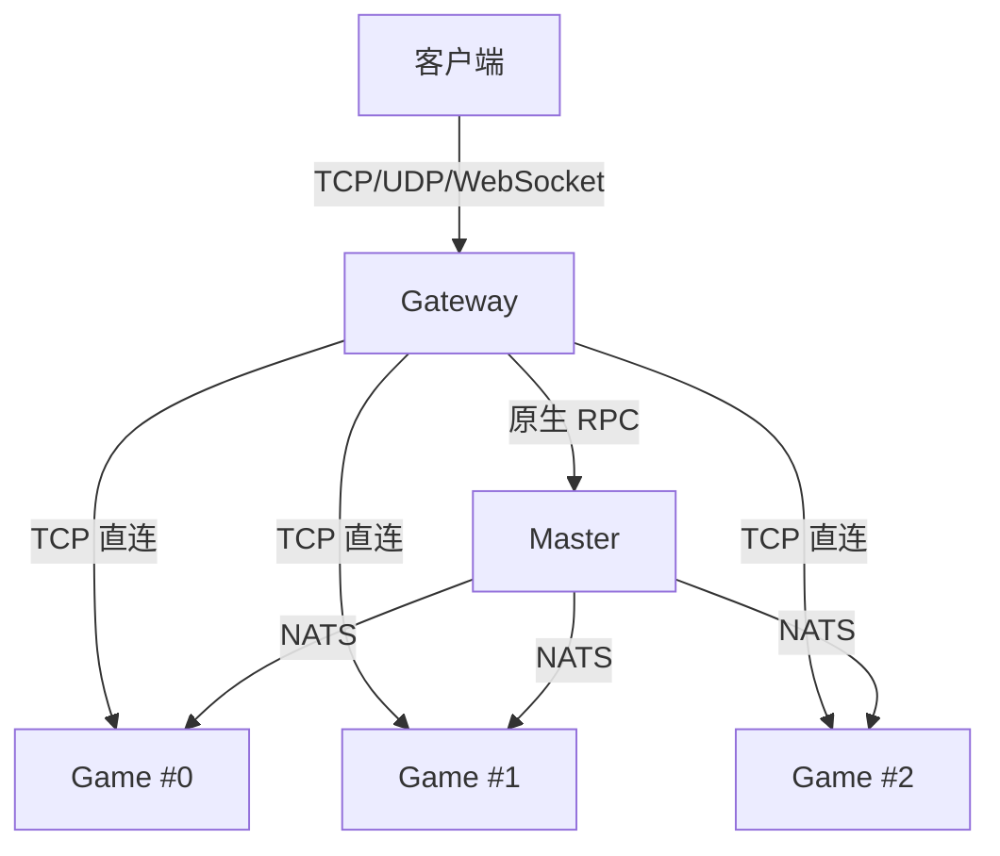
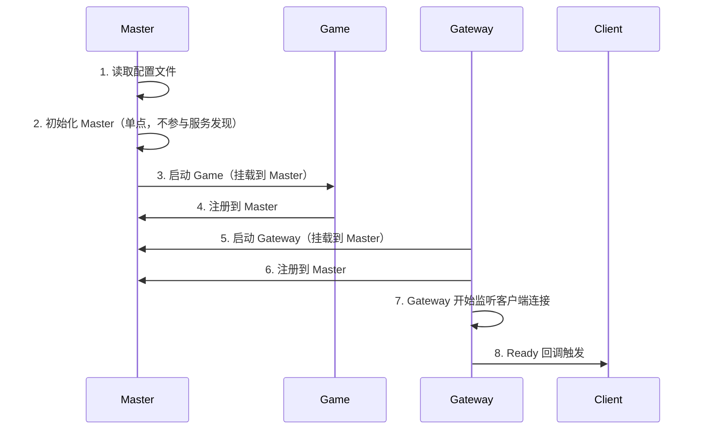
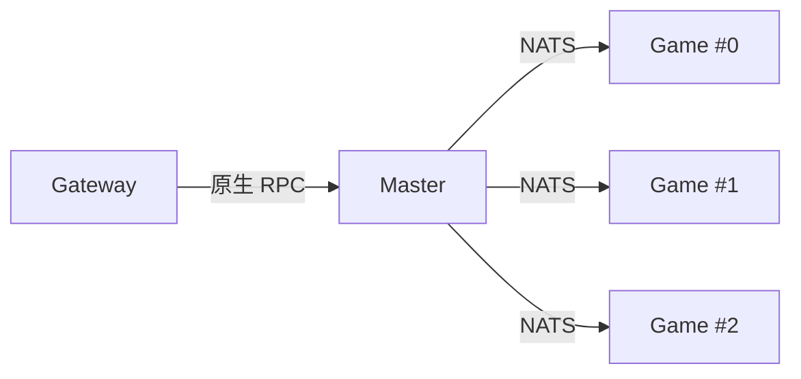

# 三个角色

## 这篇文档讲什么？

本文档介绍 Clover 服务端的三种进程角色：Gateway、Game 和 Master，以及它们各自的职责和交互方式。目标读者是想要理解系统架构的开发者。

## 前置条件

- 了解分布式系统基础
- 熟悉网络编程概念

## 核心流程

Clover 服务端由三种进程组成，各自职责不同：



| 角色 | 职责 | 关键能力 |
|------|------|---------|
| **Gateway** | 面向客户端的网络入口 | TCP/UDP 连接管理、协议加解密、请求路由 |
| **Game** | 业务逻辑执行 | 状态机、房间、AOI、战斗、持久化 |
| **Master** | 全局协调 | 会话管理、跨进程 RPC、全局状态协调 |

> **注意：** 三个角色可以部署在不同机器上，也可以跑在同一个进程里（all 模式）。

## all 模式

开发和调试时，三种角色跑在同一个进程里，通过 `app.Run()` 启动：

```go
package main

import (
    "clover-server-engine/pkg/app"
    "clover-server-engine/pkg/foundation/logger"
    _ "your-game/logic"
)

func main() {
    if err := app.Run("configs/all"); err != nil {
        logger.Fatal("启动失败", logger.Field("err", err))
    }
}
```

`configs/all` 目录下使用统一配置文件 `server.yaml`：

```yaml
# 进程角色：all=网关+逻辑服+master 同进程
server_type: "all"

# 网关接入（客户端暴露端口 8001-8100）
gateway:
  listen_ws: "127.0.0.1:8001"       # WebSocket
  listen_tcp: "127.0.0.1:8002"      # TCP
  listen_udp: "127.0.0.1:8003"      # UDP

# 逻辑服（内部 TCP 端口 8011-8100）
logic:
  listen_addr: "127.0.0.1:8011"     # TCP 监听
  http_listen: "127.0.0.1:8012"     # HTTP 控制面

# Master 协调服（内部 TCP 端口 8021-8030）
master_listen_addr: "127.0.0.1:8021"      # master 监听地址
master_http_listen_addr: "127.0.0.1:8022" # master HTTP 控制面
master_addr: "127.0.0.1:8021"             # game 连接 master 地址

# Log 日志服（内部端口 8031-8040）
log_listen_addr: "127.0.0.1:8031"     # log 服监听地址
log_http_listen_addr: "127.0.0.1:8032" # log 服 HTTP 控制面
log_addr: "127.0.0.1:8031"            # game 连接 log 服地址（etcd 发现不到实例时的兜底）

# Admin 运维控制面（内部端口 8041-8050）
admin:
  listen_addr: "127.0.0.1:8041"      # admin HTTP 监听地址
```

## 分离部署

生产环境下，每个角色独立部署到不同机器：

```go
// master/main.go
app.Run("configs/master")

// game/main.go
app.Run("configs/game")

// gateway/main.go
app.Run("configs/gateway")
```

## 启动流程



## Ready 回调

所有角色挂载完成、可处理请求后，框架自动运行 `app.Mount` 注册的挂载函数。业务在 `init` 中注册即可：

```go
func init() {
    app.Mount(app.RoleGame, func(g *app.Game) {
        // 注册消息处理器
        g.OnMsg(def.MsgLogin, func(c event.Ctx) error { ... })
        // 注册健康检查端点
        g.OnAdminHTTP("/health", http.HandlerFunc(func(w http.ResponseWriter, r *http.Request) {
            w.WriteHeader(http.StatusOK)
        }))
    })
}
```

## Gateway → Game 路由

Gateway 与 Game 之间为 **TCP 直连**：每条客户端连接在网关侧对应一条到逻辑服的专用 TCP（逻辑服地址来自静态配置或 etcd 发现，与 Master 注册表无关）。业务通过 `g.OnMsg(msgID, handler)` 注册消息处理器：

```go
func init() {
    app.Mount(app.RoleGame, func(g *app.Game) {
        g.OnMsg(def.MsgLogin, func(c event.Ctx) error { ... })
        g.OnMsg(def.MsgGetPlayerList, func(c event.Ctx) error { ... })
        g.OnMsg(def.MsgFrameRoomCreate, func(c event.Ctx) error { ... })
    })
}
```

## 进程间通信



Gateway → Master 使用原生 RPC，不依赖 NATS。

Game ↔ Master 使用 **TCP 直连**进行数据交换，延迟约 1ms（同机房）；NATS 只承载下行推送 / 视野同步 / 跨服事件广播。

> **注意：** Master 只做注册和协调，不做业务逻辑。如果 Master 宕机，已建立的连接不受影响，但新连接无法建立。

## 配置说明

### Gateway 配置

| 配置项 | 类型 | 默认值 | 说明 |
|--------|------|--------|------|
| `listen_ws` | string | `""`（不启用） | WebSocket 监听地址 |
| `listen_tcp` | string | `""`（不启用） | TCP 监听地址 |
| `listen_udp` | string | `""`（不启用） | UDP 监听地址 |

### Game 配置

| 配置项 | 类型 | 默认值 | 说明 |
|--------|------|--------|------|
| `listen_addr` | string | `""`（不启用） | TCP 监听地址 |
| `http_listen` | string | `""`（不启用） | HTTP 控制面地址 |

### Master 配置

| 配置项 | 类型 | 默认值 | 说明 |
|--------|------|--------|------|
| `master_listen_addr` | string | `""`（不启用） | Master 监听地址 |
| `master_http_listen_addr` | string | `""`（不启用） | Master HTTP 控制面地址 |

## 常见问题

### 连接失败

**症状**：`connection refused`

**原因**：服务未启动或端口配置错误

**解决**：
1. 检查服务是否启动
2. 确认端口配置一致
3. 检查防火墙设置

### Gateway 路由失败

**症状**：请求超时或无响应

**原因**：消息处理器未注册或 Game 实例未注册

**解决**：
1. 检查 `g.OnMsg` 是否注册了对应消息号的处理器
2. 确认 Game 实例已注册到 Master
3. 检查 Master 状态

### NATS 连接问题

**症状**：Game 间通信失败

**原因**：NATS 服务未启动或配置错误

**解决**：
1. 检查 NATS 服务状态
2. 确认 NATS 配置正确
3. 检查网络连通性