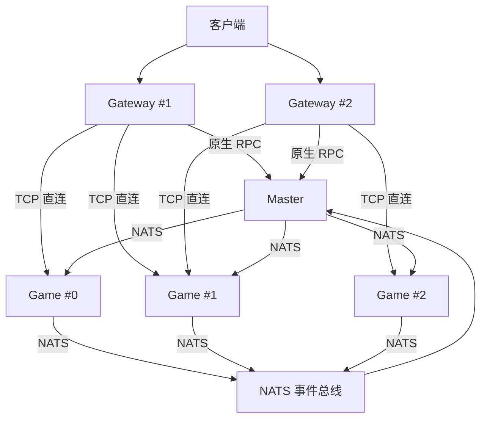

# 集群架构

## 这篇文档讲什么？

本文档介绍 Clover 引擎的集群架构，包括水平扩展、NATS 事件总线、负载均衡和容错机制。目标读者是想要部署和运维集群环境的开发者。

## 前置条件

- 了解分布式系统架构
- 熟悉集群部署概念
- 了解负载均衡和容错机制

## 核心架构



## 水平扩展

增加 Game 实例即可扩展容量：

```bash
# 启动新的 Game 实例
./game.exe -config configs/game-2
```

> **注意：** 新实例自动注册到 Master，Gateway 路由表自动更新。

## NATS 事件总线

Game ↔ Master 使用 **TCP 直连**进行数据交换（NATS 只承载跨节点事件与下行推送）：

```
Game #0 → NATS → Game #1（跨节点事件）
```

延迟约 1ms（同机房）。

## 负载均衡

Gateway 与 Game 之间为 **TCP 直连**：每条客户端连接在网关侧对应一条到逻辑服的专用 TCP（逻辑服地址来自静态配置或 etcd 发现，与 Master 注册表无关）。业务通过 `g.OnMsg(msgID, handler)` 注册消息处理器：

```go
func init() {
    app.Mount(app.RoleGame, func(g *app.Game) {
        g.OnMsg(def.MsgLogin, func(c event.Ctx) error { ... })
        g.OnMsg(def.MsgFrameRoomCreate, func(c event.Ctx) error { ... })
    })
}
```

## 容错

- Game 实例宕机：Master 检测到后，自动将请求路由到其他实例
- Master 宕机：已建立的连接不受影响，但新连接无法建立
- NATS 宕机：Game 实例间通信中断，但单实例内的业务不受影响

## 代码示例

### 集群配置

```yaml
# configs/gateway/server.yaml
server_type: "gateway"

# Gateway 配置
gateway:
  listen_ws: "0.0.0.0:8001"
  listen_tcp: "0.0.0.0:8002"
  listen_udp: "0.0.0.0:8003"

# Master 配置
master_addr: "192.168.1.100:8021"
master_token: "<强随机串>"            # master 绑非回环时**必有**；各 game/gateway 填同一个值

# NATS 配置
nats:
  addr: "nats://192.168.1.100:4222"
```

```yaml
# configs/game/server.yaml
server_type: "game"

# Game 配置
logic:
  listen_addr: "0.0.0.0:8011"
  http_listen: "0.0.0.0:8012"

# 账号服（必填：每次登录都调 /auth/verify；账号服默认要求 TLS）
auth:
  verify_addr: "https://192.168.1.100:8051"

# Master 配置
master_addr: "192.168.1.100:8021"
master_token: "<强随机串>"            # 与 master 侧 master_token 同值（非回环 master 强制握手）

# NATS 配置
nats:
  addr: "nats://192.168.1.100:4222"
```

### 服务发现

逻辑服 / 账号服 / 日志服的实例地址经 etcd 互相发现；`Master` 单分片时是固定地址直连，
多分片时**也注册到 etcd**（见下「Master 分片与节点目录」）。
日志服同时服务两条通路：同步 RPC `Game.CallLog`（每次调用轮询选实例）与业务日志管道
`Game.AddLog`（按片轮询分发到各实例，每实例一条长连接，写失败自动重连）：

```yaml
etcd:
  endpoints: ["192.168.1.100:2379"]   # 空=不启用服务发现
  register_ttl: 10s                   # 服务注册租约 TTL
```

key 约定 `clover/services/<角色>/<角色>-<主机>-<PID>`，值为该实例的可调用地址；
`<角色>` 为 `logic` / `auth` / `log`。注册带租约自动续租，实例崩溃后 etcd 自动摘除。

### 健康检查

```go
package logic

import (
    "net/http"
    "github.com/qw576483/clover-server-engine/pkg/app"
)

func init() {
    app.Mount(app.RoleGame, func(g *app.Game) {
        // 注册健康检查端点
        g.OnAdminHTTP("/health", http.HandlerFunc(func(w http.ResponseWriter, r *http.Request) {
            w.WriteHeader(http.StatusOK)
            w.Write([]byte("OK"))
        }))
        
        // 注册就绪检查端点
        g.OnAdminHTTP("/ready", http.HandlerFunc(func(w http.ResponseWriter, r *http.Request) {
            // 检查数据库连接
            if err := checkDatabase(); err != nil {
                w.WriteHeader(http.StatusServiceUnavailable)
                w.Write([]byte("Database not ready"))
                return
            }
            
            // 检查 Redis 连接
            if err := checkRedis(); err != nil {
                w.WriteHeader(http.StatusServiceUnavailable)
                w.Write([]byte("Redis not ready"))
                return
            }
            
            w.WriteHeader(http.StatusOK)
            w.Write([]byte("OK"))
        }))
    })
}
```

## Master 分片与节点目录

> 两件事都落在 etcd 上，但语义不同：**分片**解决「数据放哪」，**节点目录**解决「谁活着」。

### Master 分片（多节点，非主备）

Master 的 4 类数据各自分片，**不做主备、不做选主**（不需要 Raft / leader 选举）：

| 数据 | 分片键 | 说明 |
|---|---|---|
| 玩家定位（uid → nodeID） | `uid` | 同一玩家恒落同一分片 |
| 排行榜 | 榜名 | 同一榜恒落同一分片；`BackupAll` / `RestoreAll` 广播到全部分片 |
| session token | `playerID` | memory 后端在分片下同样正确；多分片推荐 redis（某片重启不丢） |
| 节点表 / 健康 | — | 不放在 Master，见下「节点目录」 |

> **业务查询玩家定位**：`master.NewPlayerLookup(g).Locate(ctx, uid)`，返回 `(nodeID, online, err)`。
> `online=false, err=nil` = 玩家离线；`err!=nil` = 查询通道不可用（哨兵 `master.ErrPlayerLookupUnavailable`，
> **不要当离线**）。定位表由引擎在玩家上/下线时自动登记与摘除，业务只查询；多分片时按 `uid` 自动落到属主分片。
> 见 `pkg/domain/master/README.md`。

归属计算（两端唯一契约）：`shard = Xxhash64(key) % total`。

```yaml
# master 节点配置（每台一份，index 不同）
master_shard:
  index: 0        # 本实例序号，取值 [0, total)
  total: 2        # 集群分片总数；1（默认）= 单分片，行为与未启用分片一致
```

注册键 `clover/services/master/<index>` = `{"addr":"127.0.0.1:8021","total":2}`；
Game 侧拉取该前缀并 watch（分片上下线自愈）。未配 etcd 或 `total=1` 时回落静态
`master_addr` —— **单机 / 单 Master 部署零感知**。

> **注意：** 本期不支持热扩容。改 `total` 会使 key 重新映射，必须停服迁移。

### 节点目录（存活判定交给 etcd 租约）

Game 启动时把自身登记到节点目录（租约 + 自动续租）：

```
clover/nodes/<nodeID> = {"type":"game","tags":["room"]}
```

- `type` 与 Master `state.Node.Type` **同一套取值**（如 `game`），否则按类型查节点查不到；
- 进程崩溃 / 断网 → 租约到期自动摘除，不需要心跳超时判定；
- **动态负载（在线人数）不进节点目录**：变化频繁，仍走 Master 心跳链路。

配了 etcd 后，跨节点投递的存活集合与业务的 `Game.NodesByTag` 都读节点目录的本地缓存
（watch 维护，没有 5s 轮询窗口）；Master 的节点表与心跳探测保留为**未配 etcd 时的兜底**。

## MMO 跨节点对象迁移（切场景）

一份对象只有一个 owner 节点；玩家切场景而目标场景在别的节点时，做法是**把对象所有权搬到目标节点**，而不是"远处只读"。

**接线（业务只碰这几个名字，签名见源码）**：
`pkg/app` 的 `Game.NodeID()` / `Game.SceneRoute()` / `Game.SceneSubscriber()` 三件套，交给 `mmo` 的
`WithClusterRoute(...)` 与 `WithRemoteTransferSubscriber(...)`；需要"定向接管投递"时再加 `WithClusterTransfer(...)`。
配置侧给一个 **`node_id`（数字节点标识）** —— NATS subject 不允许地址里带 `:`。

**引擎行为（实现集中在 `internal/domain/mmo/cluster.go`）**：

| 环节 | 行为 |
|---|---|
| 发布端 | `TransferRemote` **先查路由表定位目标节点、再定向投递**（早期是无条件广播，只能靠对端 `GetScene` 失败来丢弃） |
| 路由表 | `CreateScene` 登记 / `DestroyScene` 注销 / 运行期按 `DefaultSceneTTL/3` 周期续期 |
| 接收端 | 订阅定向 subject `mmo.transfer.remote.<nodeID>` → `HandleRemoteTransfer` |

**单机部署不配 `node_id` 即整体不启用**，此时 `TransferRemote` 返回 `ErrNoRoute`（明确失败，不静默）。

> **边界**：`publishMirror` → `ReceiveMirror` 是**单向全广播、无寻址、只在写提交时触发**（读不触发）；
> **在线**玩家数据只在 owner 节点内存，别处 `Load` 拿到的是 Redis / MySQL 的旧值。
> 要实时读别的节点上的数据，用"发事件过去取"（见 `event.md`），引擎**不提供**通用 `CallNode` RPC。

## 跨节点数据可见性（三条一起看）

回答「这份数据别的节点读不读得到」时，三条是配套的（原登记在 `服务器待做.md`「架构结论」，该节已随文件瘦身删除，结论落在此处）：

1. **高频数据不跨节点共享**：一份数据只有一个 owner 节点；owner 写 → 事件 / 镜像广播 → 各节点本地缓存（`MirrorEvent`、room owner 即此模型）。
2. **Redis 只做慢路径**：只承担跨节点可见（`TierSnapshot`）与重启可恢复（session / rank 备份）；热点在本地内存聚合后批量写（`flush_interval`），**禁止「每次操作都写 Redis」**。
3. **master 分片而非主备**：定位表按 uid 哈希分片到 N 个 master，节点表与健康交 etcd lease + watch，不做 leader 选举（详见上文「Master 分片与节点目录」）。

## 配置说明

### NATS 配置

| 配置项 | 类型 | 默认值 | 说明 |
|--------|------|--------|------|
| `nats.addr` | string | `""` | NATS 地址（空=不启用，降级为内存总线） |
| `nats.client_name` | string | `""` | NATS 客户端名称 |
| `nats_subject` | string | `"clover.notify"` | 下行推送 subject |

> **注意：** 当前引擎不内置 `cluster_id`、`cluster_nodes`、`cluster_timeout`、`lb_strategy`、`lb_health_check` 等集群级配置项。集群管理通过 Master 协调服完成；Gateway 到逻辑服为 TCP 直连（上游地址来自静态配置或 etcd 发现），不存在按消息号的路由分发。

## 常见问题

### 节点注册失败

**症状**：新节点无法加入集群

**原因**：Master 地址错误或网络不通

**解决**：
1. 检查 `master_addr` 配置
2. 确认网络连通性
3. 检查 Master 状态

### NATS 连接失败

**症状**：Game 实例间通信失败

**原因**：NATS 服务未启动或配置错误

**解决**：
1. 检查 NATS 服务状态
2. 确认 NATS 配置正确
3. 检查网络连通性

### 负载不均衡

**症状**：某些 Game 实例负载过高

**原因**：负载均衡策略不当或路由配置错误

**解决**：
1. 调整负载均衡策略
2. 检查路由表配置
3. 监控各实例负载