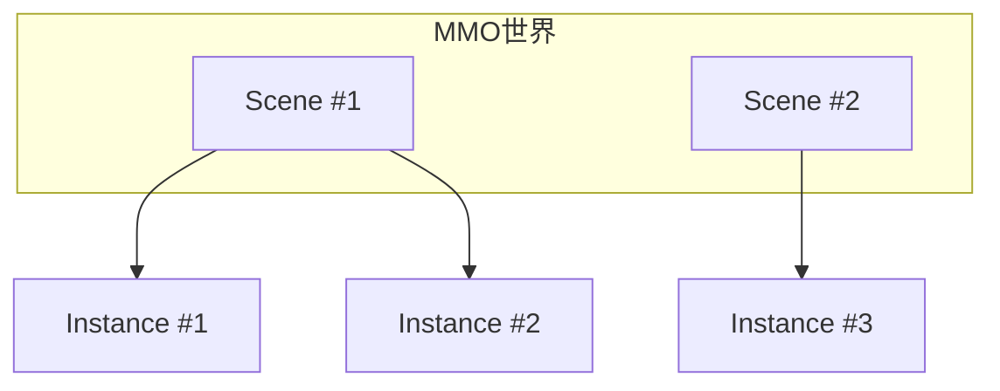

# 世界模型

## 核心概念



Clover 引擎的 MMO 模块（`pkg/domain/mmo`）提供 `SceneManager`、`Scene`、`Instance` 三层抽象：

- **SceneManager**：创建、获取、销毁场景
- **Scene**：管理一个世界中的所有对象，维护 AOI 视野关系
- **Instance**：场景内的子分区（如副本、竞技场）

## AOI 视野管理

`aoi.Grid` 按格子划分世界空间，并发安全。对象进入/离开格子时触发 `Observer` 回调：

```go
import (
    "github.com/qw576483/clover-server-engine/pkg/domain/mmo"
    "github.com/qw576483/clover-server-engine/pkg/domain/mmo/aoi"
    "github.com/qw576483/clover-server-engine/pkg/domain/object"
)

grid := mmo.NewGrid(10) // 10 米一格
grid.SetObserver(func(watcher, target object.ObjectID, ev aoi.Event) {
    // ev 为 aoi.EnterView / LeaveView
    // 通过 g.PushToPlayer 推送视野变化给客户端
})
playerID := object.NewObjectID(object.TypePlayer, 1001)
grid.Enter(playerID, aoi.Position{X: 100, Y: 0, Z: 200})
grid.Watch(playerID, 96) // 设置视野半径
```

更高层的 `aoi.VisualSystem` 在 `Grid` 之上提供双向可见性 + 过滤 + 配额：

```go
vs := mmo.NewVisualSystem(10, 96)
vs.SetObserver(func(viewer, target object.ObjectID, ev aoi.Event) {
    // 双向可见性回调
})
vs.SetFilter(func(viewer, target uint64) bool {
    return true // 自定义可见性过滤
})
```

## 场景与实例

```go
import (
    "github.com/qw576483/clover-server-engine/pkg/domain/mmo"
    "github.com/qw576483/clover-server-engine/pkg/domain/object"
    "github.com/qw576483/clover-server-engine/pkg/domain/data"
)

// 创建场景管理器（推荐传入 WithObjectManager 复用 Game 的 Manager）
sm := mmo.NewSceneManager(
    mmo.WithStore(store),
    mmo.WithPublisher(pub),
    mmo.WithObjectManager(g.ObjectManager()), // 场景内对象与 Game 门面共用同一张对象表
)

scene := sm.CreateScene(1, "主城")
objID := object.NewObjectID(object.TypePlayer, 1001).MarshalUint64()
scene.Enter(objID, mmo.Vec3{X: 100, Y: 0, Z: 200})
scene.SetViewRadius(objID, 96)

// 创建子实例（如副本）；进入指定实例走 Scene 门面（Instance 只有 ID()/Members()，没有 Enter）
inst, _ := scene.CreateInstance(1)
_ = scene.EnterOwnerTypeInstance(objID, data.OwnerPlayer, mmo.Vec3{X: 0, Y: 0, Z: 0}, inst.ID())
```

`Scene.Broadcast` 向场景全部成员广播：

```go
scene.Broadcast(def.PushFrameRoomSync, bodyBytes)
```

### 场景事件

场景支持双通道事件：`SendEvent`（并发，适合只读/通知）和 `SendQueueEvent`（串行，适合修改共享状态）。

```go
// 注册
scene.OnEvent("capture.tick", func(ctx context.Context, s mmo.Scene, eventType string, payload any) error {
    return nil
})

// 并发通道：通知
scene.SendEvent(ctx, "boss.spawn", &BossData{...})

// 串行通道：修改共享状态（同一场景所有事件互斥）
scene.SendQueueEvent(ctx, "capture.tick", &CaptureData{...})
```

Tick 里修改共享状态用 `scene.Sync` 包住：

```go
beat := mmo.NewSceneBeat(50*time.Millisecond, 0)
beat.Add(mmo.TierFast, func(dt time.Duration) {
    scene.Sync(func() { progress -= dt.Seconds() * decayRate })
})
scene.AttachBeat(beat)
```

详见 [事件系统](./event.md)。

## 房间系统

`pkg/domain/room` 是「房间外壳 + 可插拔内核」：`room.Module` 只管归属与生命周期，
房间内部「怎么同步」由 `room.Kernel` 决定（引擎内置帧同步内核；状态同步等由业务自写内核经 `Config.Kernel` 挂入）：

```go
import (
    "github.com/qw576483/clover-server-engine/pkg/domain/room"
    "github.com/qw576483/clover-server-engine/pkg/domain/room/frame"
)

// ★ 必须用 room.NewModule 构造（它按 Config 装配「外壳 + 内核」）。
//   FrameCfg 是真正的「房间默认配置」，这里的 TargetFPS 会生效。
roomMod := room.NewModule(room.Config{
    Pusher:   broadcaster.Broadcast,        // 向玩家推送帧数据
    FrameCfg: &frame.Config{TargetFPS: 50}, // 50 FPS ⇒ 20ms 一帧（真实生效）
})

// 外壳 API 与同步方式无关：若把 FrameCfg 换成 Config.Kernel（业务自写内核），
// 下面两行完全不变。
if err := roomMod.EnsureRoom("room-001"); err != nil {
    return err
}
if _, _, err := roomMod.JoinRoom(c.ConnID(), "room-001", c.PlayerID()); err != nil {
    return err
}
// 帧同步专属能力（Input/Snapshot/Recovery 等）经 roomMod.Frame() 使用
```

具体房间创建和同步细节请参考 `pkg/domain/room` 和 `pkg/domain/room/frame` 的 API 文档。

## 世界同步

服务端通过 `g.PushToPlayer` / `g.PushToScene` / `g.PushToAll` 同步世界状态：

```go
// 全量同步
g.PushToPlayer(playerID, def.PushFullSync, &FullSync{Entities: members})

// 增量同步
g.PushToScene(scene, def.PushDeltaSync, &DeltaSync{Added: added, Removed: removed})
```

## 万人同服

通过以下技术支撑万人同服：

- **AOI 视野管理**：客户端只接收视野内的实体更新
- **增量同步**：只同步变化的实体，减少带宽
- **负载均衡**：多 Game 实例水平扩展
- **NATS 事件总线**：跨实例通信延迟约 1ms

## 常见问题

### AOI 计算慢

**症状**：实体移动卡顿

**原因**：AOI 算法效率低或实体数量过多

**解决**：
1. 调整 `cellSize` 参数
2. 减少视野半径
3. 使用 `VisualSystem` 的配额功能

### 场景同步延迟

**症状**：玩家看到的场景状态不准确

**原因**：同步间隔过长或网络延迟

**解决**：
1. 使用 `Scene.SetViewRadius` 调整视野
2. 检查 NATS 连接状态
3. 优化推送频率
