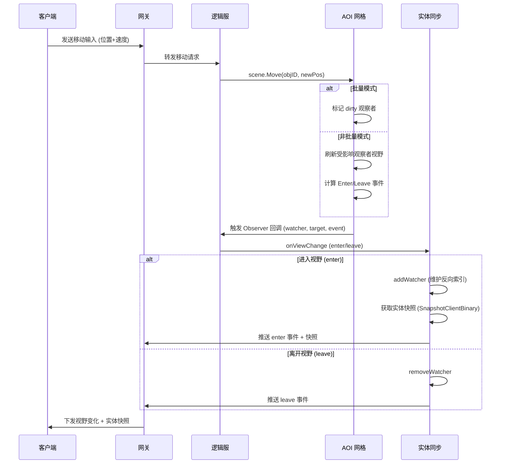
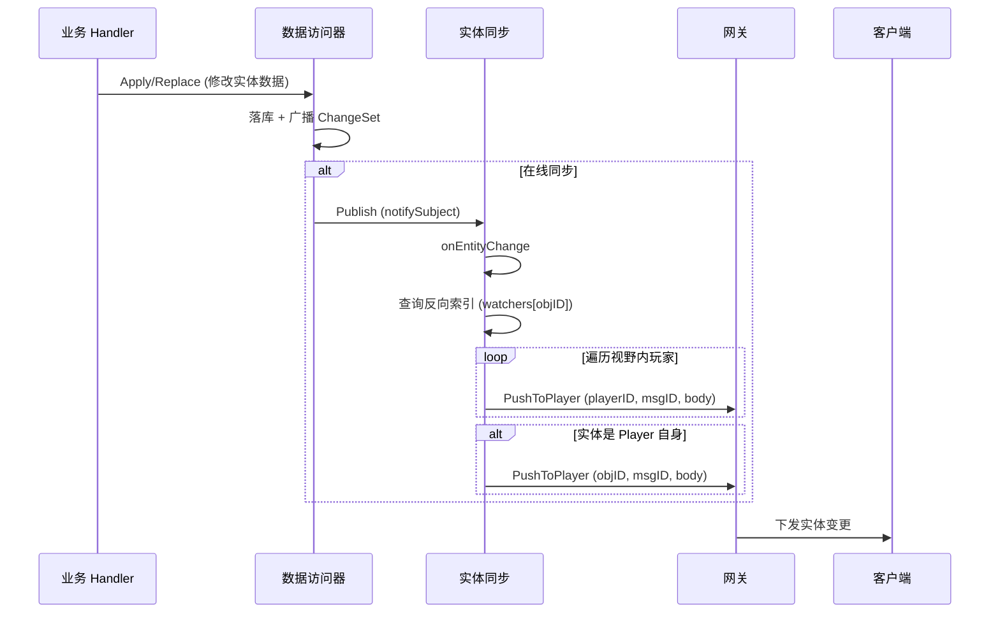
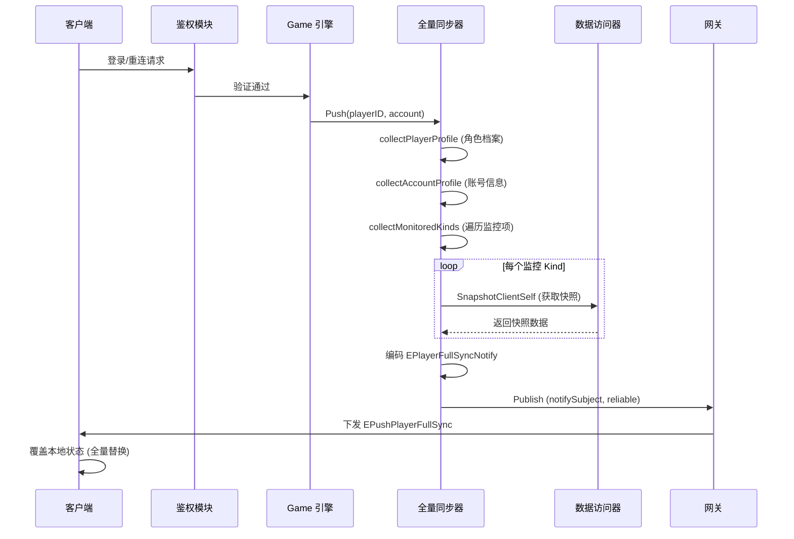
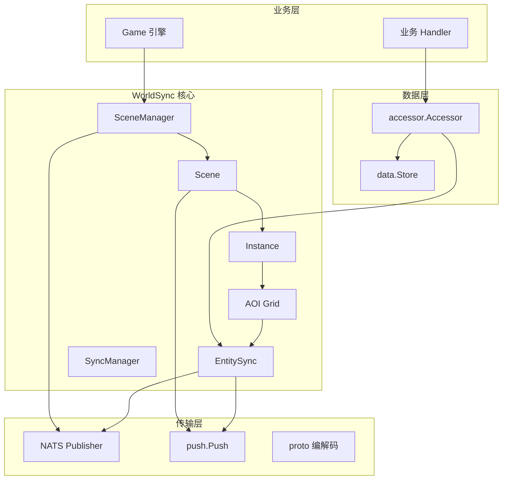

# WorldSync 世界同步系统

## 模块概览

WorldSync 是 Clover 引擎的 MMO 大世界状态同步核心，负责将服务器权威的实体状态（位置、属性、视野变化）高效、可靠地同步到客户端。它基于 AOI（Area of Interest）兴趣区域算法实现视野管理，支持三种移动预测档位（纯权威插值、外推预测、客户端预测与和解），并通过快照对齐机制保证登录/重连后的状态一致性。系统采用分层架构（SceneManager → Scene → Instance），结合分片锁、对象池、批量处理等性能优化手段，为大型多人在线游戏提供可扩展的同步基础设施。

## 核心概念

### 1. AOI 兴趣区域管理

AOI 是 WorldSync 的空间基础，决定了"谁能看见谁"。

**核心机制**：
- **格子空间分区**：将地图的 (x/z) 水平面按 `cellSize` 切成稀疏格子，每格挂一「列」对象，将 O(N) 的"谁在我周围"查询降至接近 O(1)
- **三维球体视野（默认）**：距离判定 X/Y/Z 全参与 —— 楼上楼下按真实空间距离计算，不会因水平投影重合而互相看见。
  索引不切 Y 轴（一列内的对象通常是个位数），因此**分片数不随楼层数膨胀**
- **分片锁并发**：按世界区域分片（`super-shard`），每片持有独立 `RWMutex`，互不重叠的区域可完全并行
- **视野增量计算**：每个观察者维护当前可见集合，移动时只计算"新进入视野"和"离开视野"两份增量
- **批量刷新模式**：`BeginBatch()`/`EndBatch()` 将一帧内的多次移动合并为一次视野重算，把 O(moves × watchers) 降至 O(watchers)

> **2D 俯视玩法**：把 Y 固定为 0 即可 —— 空间管线本身是三维的，没有平面/三维开关。
>
> **遮挡不属于 AOI**：AOI 只负责距离范围。"隔层不可见 / 被墙挡住"用 `SetFilter` / `SetPermChecker`
> 按层过滤，或用 `collide.Grid3.Raycast` 做视线判定（见下文「三维空间能力」）。

**关键 API**：
```go
// 场景层
scene.Enter(objID, pos)          // 进入场景
scene.Move(objID, pos)           // 移动（触发 AOI 重算）
scene.Leave(objID)               // 离开场景
scene.SetViewRadius(objID, r)    // 设置视野半径

// 底层 AOI Grid
grid.Watch(id, radius)           // 注册为观察者
grid.Unwatch(id)                 // 取消观察
grid.Visible(id)                 // 获取当前可见对象列表
grid.Neighbors(id, radius)       // 获取半径内其他对象
```

### 2. 移动预测三档

以下三种客户端移动同步策略中，**客户端引擎当前只实现了第 ① 种（纯权威 + 插值）**；②③（外推 / 客户端预测 + 和解）**尚未实现**，属候选方案（客户端引擎明确不做本地预测，玩法确需时由业务自行实现）：

| 档位 | 策略 | 说明 | 适用场景 |
|------|------|------|----------|
| ① 纯权威+插值 | `InterpolationStrategy` | 服务器位置为唯一来源，客户端在渲染延迟余量内线性插值平滑 | 大多数 MMO（默认） |
| ② 轻量预测（外推） | `ExtrapolationStrategy` | 基于最新快照的速度/加速度外推未来位置，超时停止外推等待新快照 | 需要中等响应速度的游戏 |
| ③ 完整预测（客户端预测+和解） | `PredictionStrategy` | 客户端本地执行输入，收到服务端权威状态后比对并修正（回滚+重放） | 动作类游戏 |

**预测补偿与回滚**（未实现，下为概念示意）：
```go
// 客户端预测策略（PredictionStrategy）
type PredictionStrategy struct {
    pendingInputs   []inputEntry  // 未确认的输入队列
    lastServerState State         // 最新服务端权威状态
    predictedState  State         // 当前预测状态
}

// 和解流程（reconcile）：
// 1. 移除服务端已确认的输入（serverTick 之前的）
// 2. 在服务端权威状态基础上重放未确认的输入
// 3. 返回修正后的预测状态
```

### 3. 快照对齐

**核心原则**：登录/重连后，服务器快照**整体覆盖**本地，禁止增量硬拼。

**全量同步（PlayerFullSync）**：
```go
type EPlayerFullSyncNotify struct {
    PlayerID     string
    Account      string
    Player       EPlayerSyncView          // 角色档案
    AccountInfo  *EAccountSyncView        // 账号信息
    Data         map[string]map[string]json.RawMessage  // 按 Kind 的实体快照
    SessionToken string                   // 会话令牌
}
```

**增量同步**：
- 实体数据变更通过 `accessor.Accessor` 广播字段级 `ChangeSet`
- `EntitySync` 维护"谁在观察哪个实体"的反向索引，只推给视野内玩家
- 支持两种消息体格式：Accessor 格式（`{ownerType, id, patch}`）和 commitEdits 格式（直接 diff）

### 4. 分组管理（Instance）

> **地图数据从哪来**（Scene 的可行走位图与碰撞体不是手写的）：引擎地图管线产出 ——
> Unity 侧烘焙（[`clover-client-unity-engine/Editor/MapBake/`](https://github.com/qw576483/clover-client-unity-engine/tree/main/Editor/MapBake)，面板 `Clover/地图烘焙`；一次写服务端 + 客户端两份同源字节）、
> 服务端加载（`pkg/domain/mmo/mapdata`：`Load` → `ApplyTo(scene)`，位图 → `NavGrid3`、AABB → `Collider3(GroupWall)`、出生点净空校验）、
> 客户端查询（`Game.Map.WalkableAt`）。字节契约见 `pkg/domain/mmo/mapdata/README.md`。

**三级结构**：
```
SceneManager (全局容器)
 └─ Scene ("map") 一张地图（共享物理碰撞）
      ├─ Instance 0  默认实例（公共区，所有玩家互相可见）
      ├─ Instance 1  个人任务实例（solo，独立 AOI）
      └─ Instance N  副本实例（组队可见）
```

**隔离规则**：
- 同一 Instance 内实体通过 AOI 互相可见
- 跨 Instance 互不可见，但共享 Scene 的物理碰撞（墙壁/障碍物）
- `DefaultInstance = 0` 用于不关心分实例的场景
  ⛔ **业务侧写 `mmo.DefaultInstance` 编译不过**：该常量只存在于 `internal/domain/mmo`，
  `pkg/domain/mmo` **没有做转发**。业务直接用字面量 `0`，或在自己包里定义一个 `const DefaultInstance = 0`。

**广播策略**：
```go
// 全局广播（所有 Instance 的所有成员）
scene.Broadcast(msgID, body)

// 单点发送
scene.SendTo(objID, msgID, body)

// 视野内广播（通过 EntitySync 反向索引自动路由）
// 实体变更只推给视野内的 watcher
```

## 接口说明

### SceneManager 核心 API

| 方法 | 说明 |
|------|------|
| `NewSceneManager(opts ...Option)` | 创建全局场景管理器 |
| `sm.CreateScene(id, name)` | 创建场景 |
| `sm.GetScene(id)` | 获取场景 |
| `sm.DestroyScene(id)` | 销毁场景并踢出全部成员 |
| `sm.TransferRemote(dstID, objID, pos)` | 跨机器迁移对象到目标场景坐标（`pos` 为三维落点，含高度 Y） |
| `sm.Run(ctx)` | 阻塞启动，运行心跳直到 ctx 取消 |

### Scene 场景 API

| 方法 | 说明 |
|------|------|
| `scene.Enter(objID, pos)` | 以坐标进入场景 |
| `scene.EnterOwnerType(objID, ownerType, pos)` | 以指定实体类型进入默认 instance |
| `scene.EnterOwnerTypeInstance(objID, ownerType, pos, instanceID)` | 以指定实体类型进入指定 instance |
| `scene.Leave(objID)` | 离开场景 |
| `scene.Move(objID, pos)` | 移动到指定坐标（触发 AOI 同步） |
| `scene.MoveBatch(moves)` | 批量移动，整帧只刷新一次 AOI |
| `scene.BeginBatch()` / `scene.EndBatch()` | 手动批量模式，累积后统一刷新 |
| `scene.SetViewRadius(objID, radius)` | 设置视野半径；r≤0 取消观察 |
| `scene.Members()` | 场景内全部成员 id |
| `scene.Neighbors(objID, radius)` | 半径内其他对象 id |
| `scene.Around(objID, radius)` | 半径内全部对象（含自身） |
| `scene.Position(objID)` | 对象坐标（三维，含高度 Y） |
| `scene.Broadcast(msgID, body)` | 全员广播（可靠传输） |
| `scene.SendTo(objID, msgID, body)` | 单点发送 |

### Instance 实例 API

| 方法 | 说明 |
|------|------|
| `scene.CreateInstance(id)` | 创建隔离实例（返回 `Instance` 门面） |
| `scene.RemoveInstance(id)` | 删除实例 |

### 三维空间能力

空间管线整体按三维工作（Y = 高度），2D 俯视玩法把 Y 固定为 0 即可，无需配置：

| 能力 | 入口 | 说明 |
|------|------|------|
| 三维视野 | `scene.SetViewRadius` / `Neighbors` / `Around` | 球体判定，X/Y/Z 全参与距离 |
| 三维碰撞宽相 | `scene.Collider3()` → `collide.Grid3` | `QueryRegion` / `QuerySphere` / `Nearby` / `Collisions` / `DeepCollisions` |
| 立体弹道 / 视线 | `Grid3.SweepCCD(id, from, to)` / `Grid3.Raycast(from, to)` | 线段在三维空间求首个碰撞点（slab 法），返回 `(被挡对象, t∈[0,1])`；**楼板与天花板参与遮挡** |
| 三维物理 | `scene.AddBody` / `ApplyForce` / `SetVelocity` | `Body` 位置/速度/力均为 `Vec3`；无内置重力，需要重力用 `mover`（带跳跃/飞行态与高度场落地） |
| 多层寻路 | `collide.NewNavGrid3()` + `AddLayer` / `AddLink` | 层内八方向 A* + 层间连接（楼梯/坡道/电梯/跳点/传送），`FindPath3` 返回三维路径点 |

### 同步策略 API

| 方法 | 说明 |
|------|------|
| `NewSyncManager(mode)` | 按传入的 `mode` 分支创建管理器。⚠️ **不是"自动选择"** —— 传了未知 mode 会**静默回落为插值策略**（只打一条 Warn） |
| `NewInterpolation(renderDelayMS, maxHistory)` | 创建插值策略（默认 100ms 延迟，6 帧历史） |
| `NewExtrapolation(maxExtrapMS)` | 创建外推策略（默认 200ms 最大外推） |
| `NewPrediction(maxPending)` | 创建客户端预测策略（默认 10 待确认输入） |

## 流程图：移动同步流程

### 1. 客户端移动同步流程



### 2. 实体变更同步流程



### 3. 全量快照同步流程（登录/重连）



## 依赖关系

### 核心依赖

| 组件 | 路径 | 职责 |
|------|------|------|
| **data.Store** | `internal/domain/data/` | 实体数据持久化存储 |
| **accessor.Accessor** | `internal/domain/data/accessor/` | 跨实体数据访问门面，提供快照与变更广播 |
| **object.ObjectID** | `internal/domain/object/` | 实体唯一标识（Type + Seq） |
| **transport.Publisher** | `internal/transport/pubsub/` | NATS 消息发布（视野事件、实体变更） |
| **proto** | `internal/shared/proto/` | 网络协议编码（Push、视野协议） |
| **push** | `internal/transport/net/push/` | 玩家消息推送（网关下行） |

### 内部模块

| 模块 | 路径 | 职责 |
|------|------|------|
| **spatial/aoi** | `internal/domain/mmo/spatial/aoi/` | 核心 AOI 网格实现（格子分区、视野计算） |
| **collide** | `pkg/domain/mmo/collide/` | 物理碰撞检测（共享跨 Instance） |
| **sync** | `internal/domain/mmo/sync/core/` | 同步策略（插值、外推、客户端预测） |
| **EntitySync** | `internal/domain/mmo/entitysync.go` | 实体变更按视野路由推送 |
| **viewproto** | `internal/domain/mmo/viewproto.go` | 视野同步紧凑二进制协议 |

### 外部服务

| 服务 | 用途 |
|------|------|
| **NATS** | 视野事件、实体变更的消息总线 |
| **Redis** | 会话存储、分布式锁（可选） |
| **MySQL** | 实体数据持久化 |
| **etcd** | 服务发现、配置管理 |

### 调用关系图



## 性能优化策略

### 1. 分片锁并发
- AOI 网格按世界区域分片（`super-shard`），每片独立 `RWMutex`
- 移动操作只锁定影响区域覆盖的少数几片，避免全局锁争用
- 分片按坐标确定性排序后加锁，杜绝跨分片死锁

### 2. 对象池复用
- `viewBatchPool`、`watcherBatchPool`、`eventBufPool` 等复用高频分配对象
- 热路径逼近零分配，降低 GC 压力

### 3. 批量处理
- `BeginBatch()`/`EndBatch()` 将一帧内的多次移动合并为一次视野重算
- 把 O(moves × watchers) 降至 O(watchers)

### 4. 紧凑二进制协议
- 视野同步使用 `viewproto` 零反射二进制编码
- 内部链路开销降低 30%~50%

### 5. 增量同步
- 实体变更只推给视野内玩家（通过 `EntitySync` 反向索引）
- 避免全服广播，减少网络流量

## 配置参数

> ⛔ **最后两行不可配**：`maxQueryRadius` / `cleanupInterval` 是 AOI 包里的**未导出常量**，
> 没有任何 Option、配置键或构造函数入口能改到它们（超限只打日志截断）。
> 它们在表里只为解释行为 —— 按这张表去"调参"**不会有任何效果**。

| 参数 | 默认值 | 说明 |
|------|--------|------|
| `cellSize` | 1.0 | AOI 格子边长（建议略大于常见视野半径） |
| `tickRate` | 50ms | 心跳频率（20fps） |
| `viewSubject` | - | 视野同步的 NATS subject |
| `renderDelayMS` | 100ms | 插值渲染延迟（2~3 帧） |
| `maxHistory` | 6 | 插值策略最大保留快照数 |
| `maxExtrapMS` | 200ms | 外推策略最大外推时间 |
| `maxPending` | 10 | 客户端预测最大待确认输入数 |
| ⚠️ `maxQueryRadius` | 500.0 | AOI 查询半径上限 —— **内部常量，不可配** |
| ⚠️ `cleanupInterval` | 30s | 空网格/空分片清理间隔 —— **内部常量，不可配** |

## 最佳实践

1. **批量移动**：高频移动场景使用 `MoveBatch()` 或 `BeginBatch()`/`EndBatch()`，减少视野重算次数
2. **预测模式选择**：根据游戏类型选择合适的预测档位，大多数 MMO 使用默认的纯权威+插值
3. **视野半径设置**：合理设置 `cellSize` 和视野半径，平衡视野范围与性能
4. **快照缓存**：`accessor.Accessor` 自动缓存客户端可见快照，避免重复计算
5. **跨 Instance 隔离**：利用 Instance 实现副本、个人空间等隔离场景

## 常见问题

### Q: 实体位置不同步（或画面抖动）
**原因**：客户端直接拿 `OnEntityMove` 的**离散目标坐标**驱动 Transform；服务端位置约 10Hz 下发，直接贴会抖
**解决**：表现层每帧用 `Game.Sync.TryGetPosition(id, out x, out y, out z)` 读**插值后**的位置；
`OnEntityMove` 的目标坐标只用于逻辑判定。引擎**没有**本地预测 / 回滚 / 预测档位（详见 [WorldSync](../../client/development/worldsync.md)）

### Q: 重连后状态不一致
**原因**：本地状态未正确覆盖
**解决**：确保监听 `Net.PlayerFullSync` 事件，检查本地状态清理逻辑

### Q: 视野内实体过多导致卡顿
**原因**：视野半径过大或实体密度过高
**解决**：减小视野半径，优化实体分布，使用分片锁并发

### Q: 移动预测回滚频繁
**原因**：网络延迟过高或预测参数不合理
**解决**：调整 `maxPending` 参数，或切换到纯权威+插值模式

## 下一步

1. [客户端 WorldSync 开发指南](../../client/development/worldsync.md)
2. [Entity 与 View](../../client/development/entity-view.md)
3. [网络与会话](../../client/development/network.md)
4. [Event / Timer / Fsm](../../client/development/event-timer-fsm.md)

