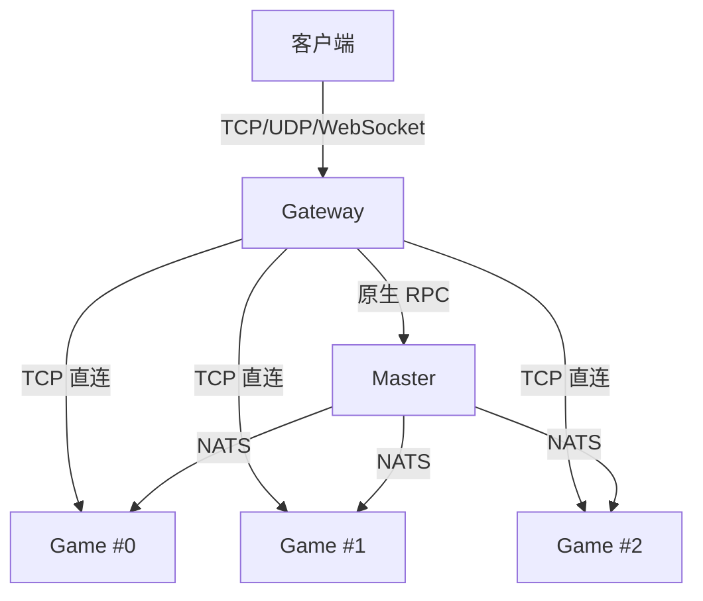

# 网络连接

## 这篇文档讲什么？

本文档介绍 Clover 引擎的网络拓扑结构，包括 Gateway、Logic、Master 和 Game 的网络连接方式。目标读者是想要理解网络架构的开发者。

## 前置条件

- 了解分布式系统网络基础
- 熟悉 TCP/UDP/WebSocket 协议
- 了解网络地址和端口概念

## 核心架构



## Gateway

- 监听客户端 TCP/UDP 连接
- 默认端口：8001（WebSocket）、8002（TCP）、8003（UDP）
- 支持 QUIC、WebSocket、WebTransport

```go
// Gateway 配置
gateway:
  listen_ws: "127.0.0.1:8001"      # WebSocket
  listen_tcp: "127.0.0.1:8002"     # TCP
  listen_udp: "127.0.0.1:8003"     # UDP
  enable_wt: true                   # WebTransport
```

## Logic

- 逻辑服监听地址
- 默认端口：8011（TCP）、8012（HTTP）

```go
// Logic 配置
logic:
  listen_addr: "127.0.0.1:8011"    # TCP
  http_listen: "127.0.0.1:8012"    # HTTP
```

## Master

- 监听 RPC 连接
- 默认端口：8021
- 不直接面向客户端

```go
// Master 配置
master_listen_addr: "127.0.0.1:8021"
master_http_listen_addr: "127.0.0.1:8022"
```

## Game

- 通过 TCP 直连 Master
- 不直接面向客户端
- 多实例部署时通过 NATS 协作

```go
// Game 配置
master_addr: "127.0.0.1:8021"  # 连接 Master 地址
```

## 端口规划

| 服务 | 端口范围 | 协议 | 用途 |
|------|----------|------|------|
| Gateway WebSocket | 8001-8100 | WebSocket | 客户端接入 |
| Gateway TCP | 8001-8100 | TCP | 客户端接入 |
| Gateway UDP | 8001-8100 | UDP | 客户端接入 |
| Logic TCP | 8011-8100 | TCP | 内部通信 |
| Logic HTTP | 8011-8100 | HTTP | 控制面 |
| Master TCP | 8021-8030 | TCP | 内部通信 |
| Master HTTP | 8021-8030 | HTTP | 控制面 |
| Log TCP | 8031-8040 | TCP | 日志服务 |
| Log HTTP | 8031-8040 | HTTP | 日志控制面 |
| Admin HTTP | 8041-8050 | HTTP | 运维控制面 |

## 配置示例

`configs/all/server.yaml`：

```yaml
# 进程角色
server_type: "all"

# Gateway 配置
gateway:
  listen_ws: "127.0.0.1:8001"      # WebSocket
  listen_tcp: "127.0.0.1:8002"     # TCP
  listen_udp: "127.0.0.1:8003"     # UDP

# Logic 配置
logic:
  listen_addr: "127.0.0.1:8011"    # TCP
  http_listen: "127.0.0.1:8012"    # HTTP

# Master 配置
master_listen_addr: "127.0.0.1:8021"
master_http_listen_addr: "127.0.0.1:8022"
```

## 代码示例

### 客户端连接

```go
package main

import (
    "net"
    "time"

    "github.com/qw576483/clover-server-engine/pkg/foundation/logger"
)

func main() {
    // 网关 TCP 连接（server.yaml 的 gateway.listen_tcp，默认 8002；8001 才是 WebSocket 口）
    conn, err := net.DialTimeout("tcp", "127.0.0.1:8002", 5*time.Second)
    if err != nil {
        logger.Fatal("连接失败", logger.Field("err", err))
    }
    defer conn.Close()
    
    logger.Info("连接成功")
}
```

### 连接 Master

Master 是**固定地址**直连（单点，不参与 etcd 服务发现）；逻辑服 / 账号服 / 日志服之间才走
etcd 服务发现（见 `concepts/cluster.md`「服务发现」）。

```go
masterAddr := "127.0.0.1:8021"
conn, err := net.DialTimeout("tcp", masterAddr, 5*time.Second)
if err != nil {
    logger.Fatal("连接 Master 失败", logger.Field("err", err))
}
```

## 配置说明

### Gateway 配置

| 配置项 | 类型 | 引擎默认值 | 说明 |
|--------|------|--------|------|
| `listen_ws` | string | `""`（不启用） | WebSocket 监听地址；demo 约定 `127.0.0.1:8001` |
| `listen_tcp` | string | `""`（不启用） | TCP 监听地址；demo 约定 `127.0.0.1:8002` |
| `listen_udp` | string | `""`（不启用） | UDP 监听地址；demo 约定 `127.0.0.1:8003` |
| `enable_wt` | bool | `true` | 是否在 `listen_ws` 端口号上启用 WebTransport（UDP 侧） |
| `max_conns` | int | `0`（不限制） | 最大连接数 |
| `max_frame_size` | int | `10485760`（10 MiB） | 上行客户端帧最大长度（= `session.MaxFrameSize`，与客户端帧上限常量同值） |

> 引擎 `DefaultConfig()` 的 `listen_ws/tcp/udp` 均为**空串**（对应协议不启用），
> 上表「业务约定」一列来自业务工程的 `configs/all/server.yaml`，不是引擎内置默认。

### Logic 配置

| 配置项 | 类型 | 默认值 | 说明 |
|--------|------|--------|------|
| `listen_addr` | string | `""`（不启用） | TCP 监听地址 |
| `http_listen` | string | `""`（不启用） | HTTP 监听地址 |
| `heartbeat` | duration | `"30s"` | 心跳间隔 |

### Master 配置

| 配置项 | 类型 | 默认值 | 说明 |
|--------|------|--------|------|
| `master_listen_addr` | string | `""`（不启用） | Master 监听地址 |
| `master_http_listen_addr` | string | `""`（不启用） | Master HTTP 控制面地址 |

### 环境变量

> 引擎不支持用环境变量覆盖配置，改用不同的配置文件或 `-config` 指定路径。
> 详见 [配置加载](../development/configuration.md)。

## 常见问题

### 端口冲突

**症状**：`bind: address already in use`

**原因**：端口被其他进程占用

**解决**：
1. 检查端口占用：`netstat -tulpn | grep :8001`
2. 停止占用进程
3. 修改配置使用其他端口

### 连接超时

**症状**：`dial tcp: connect: connection timed out`

**原因**：网络不通或防火墙阻止

**解决**：
1. 检查网络连通性：`ping 127.0.0.1`
2. 检查防火墙设置
3. 确认服务已启动

### 连接数限制

**症状**：`too many open files`

**原因**：系统文件描述符限制

**解决**：
1. 增加系统限制：`ulimit -n 65535`
2. 调整 Gateway `max_conns` 配置
3. 优化连接管理