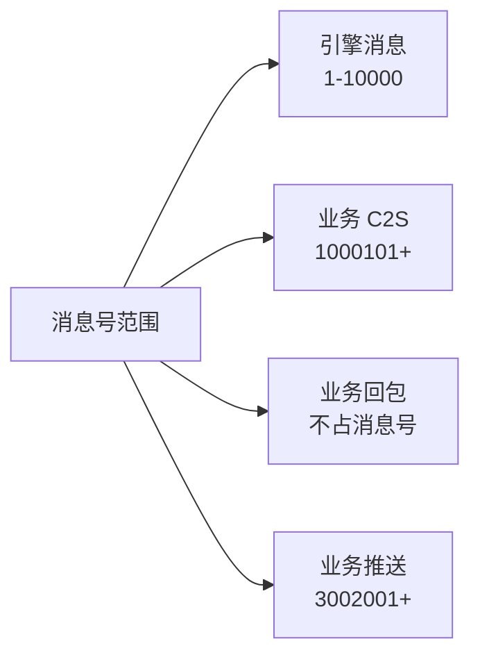

# 消息号分配

## 核心概念

消息号按段隔离，避免冲突：



## 消息号分配

| 范围 | 归属 | 说明 |
|------|------|------|
| 1 - 10000 | 引擎 | `proto.EMsgLogin=2`、`proto.EMsgResumeSession=3`、网关直发帧 `EMsgUDPBindGrant=6` / `EMsgQueuePosition=7`、推送 `EPushPlayerFullSync=4001…`；1 号原为 `EMsgSignup`，已作废保留；错误回包 `EMsgError=0xFFFFFFFF` 不属于任何号段 |
| 1000101+ | 业务 C2S | `MsgGetPlayerList`、`MsgCreatePlayer` 等 |
| 无 | 业务回包 | **不占消息号**：按 requestID 配对，回包帧 msgID 恒为 0 |
| 3002001+ | 业务推送 | `PushFrameRoomSync`、`PushDemoBroadcast` 等 |

> **注意：** 业务消息号约定从 1000101 起，回包**不占消息号**（按 requestID 配对、msgID 恒为 0），推送从 3002001 起。消息号定义在业务 `def` 包中。

## 消息定义

```go
// def/msg.go
package def

const (
    // 业务消息号（Msg 前缀，从 1000101 起）
    MsgGetPlayerList = 1000101
    MsgCreatePlayer  = 1000102
    MsgEnterGame     = 1000103
)

// def/reply.go
package def

// 回包**不占消息号**：引擎按 requestID 配对（回包帧 msgID 恒为 0），
// 所以这里只定义回复体结构，命名约定为「<请求名>Reply」。

// def/push.go
package def

const (
    // 推送消息号（业务推送从 3002001 起）
    PushFrameRoomSync = 3002001  // 帧同步数据
    PushDemoBroadcast = 3003001  // 演示广播
)

// 消息结构体
type CreatePlayerRequest struct {
    Name string `json:"name"`
}

type CreatePlayerReply struct {
    Summary  string `json:"summary"`
    PlayerID string `json:"player_id,omitempty"`
}
```

## 请求-回包配对

回包帧的 `requestID` 与请求帧配对，`msgID` 恒为 0。业务可通过 `g.Reply` 回复请求，框架自动处理 requestID 配对。

## Handler 注册

```go
package logic

import (
    "github.com/qw576483/clover-server-engine/pkg/app"
    "github.com/qw576483/clover-server-engine/pkg/transport/event"
    "your-game/def"
)

func init() {
    app.Mount(app.RoleGame, func(g *app.Game) {
        g.OnMsg(def.MsgGetPlayerList, func(c event.Ctx) error {
            // ...
            g.Reply(c, &def.CreatePlayerReply{PlayerID: "12345"})
            return nil
        })
        g.OnMsg(def.MsgCreatePlayer, func(c event.Ctx) error {
            var req def.CreatePlayerRequest
            if err := c.BindMsg(&req); err != nil {
                return err
            }
            // ...
            return nil
        })
    })
}
```

## 推送

服务端主动推送给客户端：

```go
// 向指定玩家推送
g.PushToPlayer(playerID, def.PushDemoBroadcast, &PlayerEnter{ID: playerID})

// 场景广播
g.PushToScene(scene, def.PushFrameRoomSync, frameData)

// 全服广播
g.PushToAll(def.PushSystemNotice, &SystemNotice{Msg: "维护公告"})
```

## 错误回包

handler 返回错误时，引擎自动回复客户端错误码（`proto.EMsgError`）：

```go
func onSomething(c event.Ctx) error {
    // 处理失败时
    return def.ErrSomethingWrong // 自动回复客户端错误码
}
```

## 网络帧格式

TCP 流（**QUIC 已实现**：流分帧为 `[4B 大端长度][客户端帧]`、**无 type 字节**；WebTransport 客户端未接入）：

```
[1B type][4B length][4B requestID][4B msgID][body]
```

裸 UDP：

```
[0x55][4B requestID][4B msgID][body]
```

- `type`：传输层帧类型（`0`=数据、`1`=ping、`2`=pong、`3`=会话迁移；见 `internal/transport/net/tcp/codec.go`）
- `length`：其后 `[requestID][msgID][body]` 的字节长度（不含 `type` 与自身），防粘包
- `requestID` == 0 表示推送
- 裸 UDP 首字节 0x55 魔数

## 常见问题

### 消息号冲突

**症状**：消息处理错误

**原因**：消息号重复定义

**解决**：
1. 检查消息号分配表
2. 确保业务消息号 >= 1000101
3. 使用 `grep` 搜索重复定义

### 消息解析失败

**症状**：`invalid message format`

**原因**：消息体格式错误

**解决**：
1. 检查消息结构体 JSON 标签
2. 确认 JSON 编码正确
3. 验证消息大小不超过 `gateway.max_frame_size`

### 推送失败

**症状**：客户端未收到推送

**原因**：推送目标不存在或网络问题

**解决**：
1. 检查玩家连接状态
2. 确认推送消息号正确
3. 验证返回的 error
