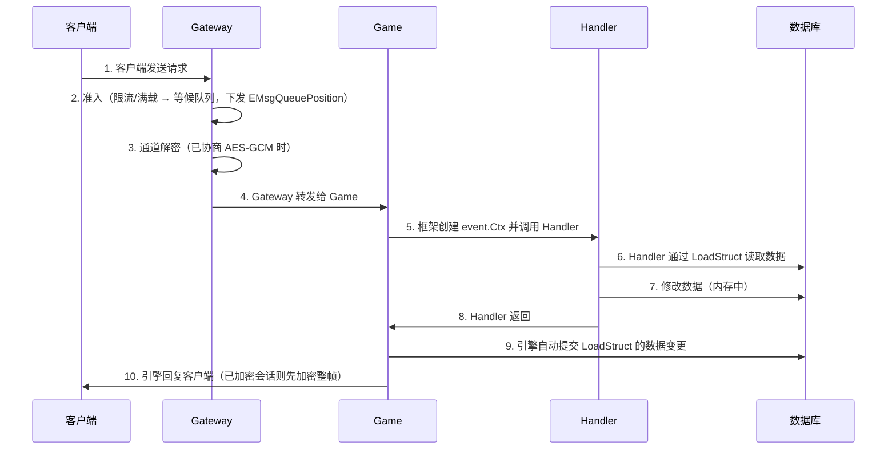

# 完整流程

## 核心流程



> 步骤 2 / 3 是**引擎内部**动作，业务无感：准入不通过时连接进队列（`gateway.queue_cap>0`）或直接被关；
> 通道解密用的是登录时协商的会话密钥（见 [`security/auth.md`](../security/auth.md) §会话通道加密）。
> 客户端的对称实现（排队 UI、加密态查询）见 [`client/development/network.md`](../../client/development/network.md)。

## 帧解析

TCP 流（QUIC / WebTransport 已实现）：

```
[1B type][4B length][4B requestID][4B msgID][body]
```

- `type`：传输层帧类型（`0`=数据、`1`=ping、`2`=pong；原 `3`=会话迁移已删除）
- `length`：其后 `[requestID][msgID][body]` 的字节长度（不含 `type` 与自身）
- `requestID`：请求配对 ID，0 表示推送
- `msgID`：消息号（业务 C2S 从 1000101 起）
- `body`：JSON 消息体

裸 UDP：

```
[0x55][4B requestID][4B msgID][body]
```

- 首字节 0x55 魔数标识
- 无 length 字段（UDP 天然分包）

## 路由

消息号全局唯一，客户端按消息号发送，框架按 `OnMsg(msgID, handler)` 注册表自动路由到对应 handler。Gateway 与 Game 之间为 TCP 直连：每条客户端连接在网关侧对应一条到逻辑服的专用 TCP，消息沿该连接转发。

## 错误处理

handler 返回错误时，框架自动回复客户端错误码：

```go
func onLogin(c event.Ctx) error {
    var req LoginRequest
    if err := c.BindMsg(&req); err != nil {
        return err
    }
    player, err := loadPlayer(c, req.Account)
    if err != nil {
        return err // 自动回复客户端错误码
    }
    // ...
    return nil
}
```

## 代码示例

### 完整请求处理

```go
package logic

import (
    "github.com/qw576483/clover-server-engine/pkg/app"
    "github.com/qw576483/clover-server-engine/pkg/transport/event"
    "your-game/def"
    "your-game/datadef"
)

func init() {
    app.Mount(app.RoleGame, func(g *app.Game) {
        g.OnMsg(def.MsgLogin, func(c event.Ctx) error {
            var req def.LoginRequest
            if err := c.BindMsg(&req); err != nil {
                return err
            }
            // 查询玩家数据
            var p PlayerData
            if err := g.LoadStruct(c, datadef.PlayerSchema, c.PlayerID(), &p); err != nil {
                return err
            }
            // 回复客户端
            g.Reply(c, &def.LoginReply{
                PlayerID: c.PlayerID(),
                Nickname: p.Nickname,
                Level:    p.Level,
            })
            return nil
        })
    })
}
```

## 配置说明

| 配置项 | 类型 | 默认值 | 说明 |
|--------|------|--------|------|
| `logic.frame_timeout` | duration | `30s` | 单帧处理上限 |
| `gateway.max_frame_size` | int | `10485760`（10 MiB） | 上行客户端帧最大长度（服务端帧上限唯一来源 `session.MaxFrameSize`，与客户端常量同值） |

## 常见问题

### 请求超时

**症状**：客户端收到超时错误

**原因**：Handler 执行时间过长或网络延迟

**解决**：
1. 检查 Handler 逻辑，优化性能
2. 调整 `logic.frame_timeout` 配置
3. 检查网络延迟
