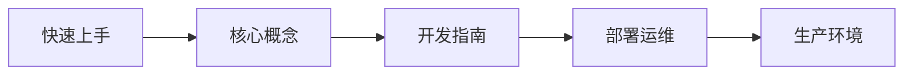

# 服务端引擎

Clover 服务端引擎是一套面向中重度游戏的 Go 分布式架构，支持 MMO / 房间竞技 / 卡牌等场景。

## 核心特性

- **分布式架构**：Gateway / Game / Master 三角色分离，支持独立部署或 all 模式单进程开发
- **状态同步**：Load-Modify-Return 模型，读取 → 修改 → 返回，引擎自动提交
- **消息路由**：Handler 模式，一个函数处理一条消息，Ctx 只读 Game 负责写
- **消息号隔离**：引擎 / 业务 C2S / 回包 / 推送三段互不干扰
- **配套齐全**：客户端引擎、工具链、文档站

## 快速开始

```go package main
package main

import (
    "github.com/qw576483/clover-server-engine/pkg/app"
    "github.com/qw576483/clover-server-engine/pkg/foundation/logger"
    _ "your-game/logic"
)

func main() {
    if err := app.Run("configs/all"); err != nil {
        logger.Fatal("启动失败", logger.Field("err", err))
    }
}
```

> **注意：**   需要 Go 1.25+。完整环境配置见 [环境安装](install.md)。

## 浏览文档

<Columns cols={2}>
  <Card title="快速上手" icon="rocket" href="/server/quickstart">
    5 分钟跑通 Demo，体验完整的消息收发流程
  </Card>
  <Card title="核心概念" icon="lightbulb" href="/server/concepts/app-game">
    了解 Gateway / Game / Master 三角色架构
  </Card>
  <Card title="开发指南" icon="code" href="/server/development/handler">
    Handler 开发、配置管理、调试技巧
  </Card>
  <Card title="部署运维" icon="server" href="/server/operations/deployment">
    Kubernetes 部署、监控告警、性能调优
  </Card>
</Columns>

## 学习路径



## 下一步

准备好了？从 [快速上手](quickstart.md) 开始，5 分钟内跑通第一个 Demo。